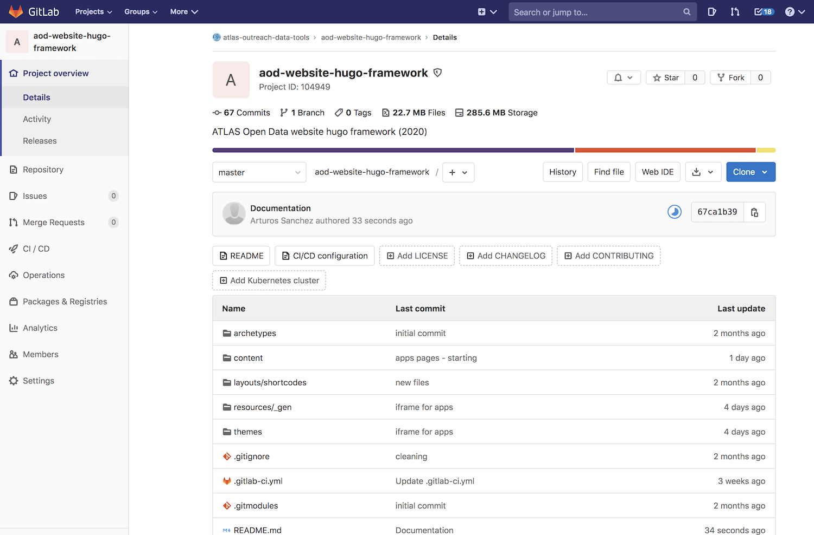
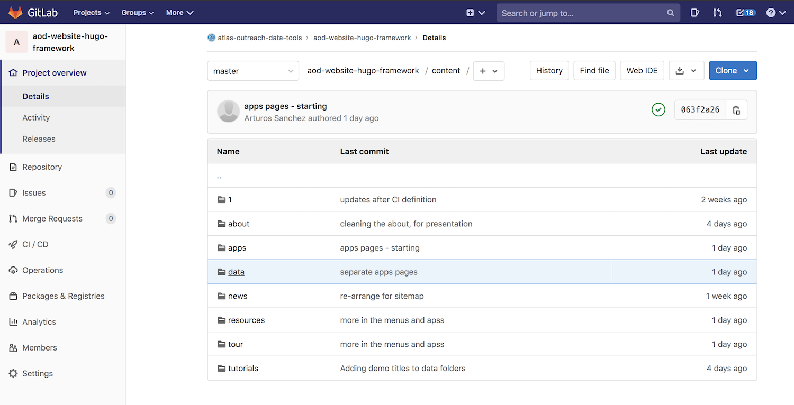
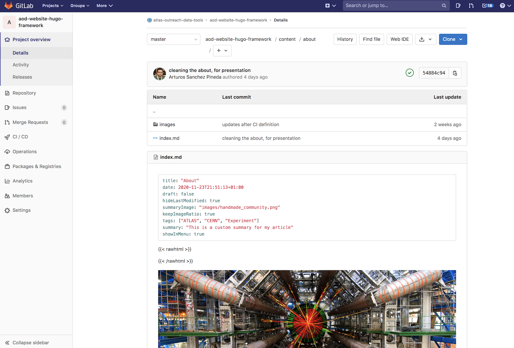
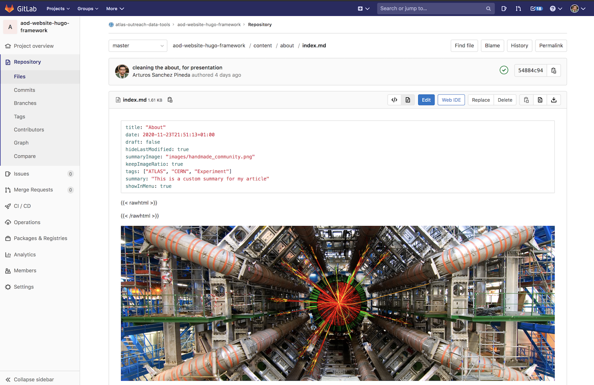
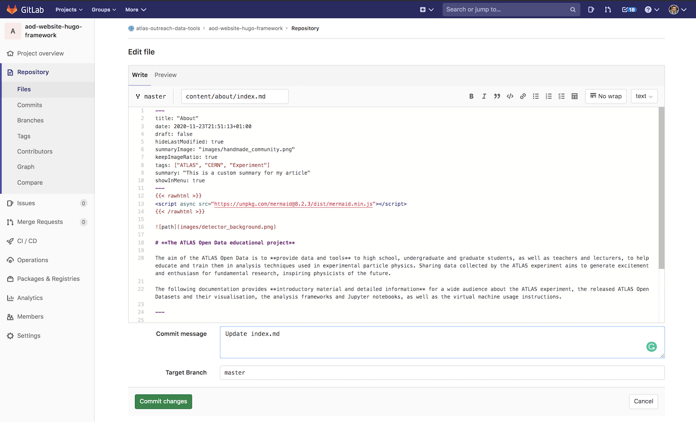

WoW project june 2021

# Page in [https://atlas-open-data-docs.github.io/WoW/](https://atlas-open-data-docs.github.io/WoW/)

--- 

# ATLAS Open Data site using [Hugo](https://gohugo.io/) Framework

This project contains the ATLAS Open Data public website for education.

It is hosted at CERN, and it uses:
* Principal domain: http://opendata.atlas.cern/
* Secondary/Backup domain: https://atlas-opendata.web.cern.ch/

---

## Who can contribute?
**Any ATLAS member is welcome and encouraged to participate** in the review and development of the content of the ATLAS Open Data website.

**You can help** in several ways:
* Reporting any issue, from a typo to a broken web app or misleading content.
* Giving us feedback on the content (physics, software, figures,...), the layout our UI & UX.
* Any feedback that is related to your local project course or educational project.
* Letting us any lack of performance of the tools hosted or promoted in this site, and of course, the site itself.
* Let us know your ideas. You are also welcome to help to implement it.
** We can evaluate together the viability and fit into the project.

**We will appreciate if you let us know in advance of any update or idea, opening a ticket in our Jira project https://its.cern.ch/jira/browse/MYATLAS**
* The project is monitoring for a small team, improving the chances of a prompt answer. And to avoid any conflict with planned interventions/updates.

---

## How to contribute?
The site is integrated to the GitLab CI/CD, so, the simplest way to edit the site is editing the content directly in the GitLab Web UI.
* The website pages use Markdown, making very easy to contribute.
 * Just like this README.**md** :)
 * It also has HTML, JavaScript and custom CSS to enhance the UX.
* The **content of the website is located in the folder called** ```content```.
* All the other folders are needed by [Hugo](https://gohugo.io/) to rendering and build the site. * Please, **do not modify files outside the folder** ```content```.

#### See this example
* **A)** You can start from the [GitLab project](https://gitlab.cern.ch/atlas-outreach-data-tools/aod-website-hugo-framework/). Don't forget to log in to CERN GitLab first.




* **B)** Go to the folder ```content``` (it is the only folder you should touch)




* **C)** Let's modify the **About** page, so, open the folder called ```about```




* **D)** And from there, the file ```index.md```




* **E)** Click the **Edit** button and you will get the web editor ready for direct edition


**Notice that** you can preview your changes, but keep in mind that GitLab only renders Markdown, other elements like HTML will be shown as plain text


* **F)** Add a meaningful commit comment. Updates to the site content will be visible after a maximum of 10 min.

* **G)** if you want to get [Hugo](https://gohugo.io/) locally, please, follow the [Hugo Documentation](https://gohugo.io/categories/getting-started) (it is **VERY** well done!).
---

## Contacts
* Contacts and meetings information:
atlas-outreach-data-and-tools@cern.ch

* Meetings, every Friday @12:00 CET

* Jira project https://its.cern.ch/jira/browse/MYATLAS

---
