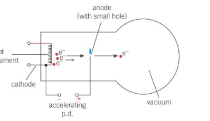

# ATLAS events





## Curriculum Learning Objective: Understand decay of particles in terms of the quark model

[e.g. OCR A-level 6.4.2(I)]

Beams of [protons](https://en.wikipedia.org/wiki/Proton) are accelerated around the ring of the [Large Hadron Collider (LHC)](http://home.cern/topics/large-hadron-collider). These beams collide at the centre of the [ATLAS](https://home.cern/science/experiments/atlas) detector. These collisions produce debris in the form of new particles which fly out in all directions and are recorded by the detector. Over a billion particle interactions take place in the ATLAS detector every second. 

## Curriculum Learning Objective: Understand energy transfer (in context of particle acceleration)

Accelerating particles links to the high-school physics concept that when particles are accelerated the work done on them is converted to and therefore equal to their kinetic energy (this is covered e.g. in A-levels). Work is done on the protons by accelerating them through an electric field.





The protons within the two beams are grouped in ‘bunches’ which are squeezed down in size to increase the chances of a collision. Squeezing the protons into a smaller space increases the amount of them passing through a given volume per unit time, giving them a better chance of colliding. In the released data, the bunches crossed every 50 ns and there were about 30 collisions on average per **bunch-crossing**. This means, on average, there were about 20 million bunch crossings and 600 million collisions per second! Lots of very clever algorithms are used to pick out the interesting collisions to be analysed. This is because it would take far too long to process and gather all the data so it is better to pick the best ones and store them only.
 
An **event** is the data resulting from a particular bunch-crossing. 
 
**Pile-up** is defined as the average number of particle interactions per bunch-crossing. It is directly correlated with something known as ‘instantaneous luminosity’. 
 
[Luminosity](https://home.cern/news/opinion/cern/luminosity-why-dont-we-just-say-collision-rate) is one of the most important parameters of the LHC. Its details are hard to explain briefly, but it essentially gives a measure of how many collisions are happening in a particle accelerator. The higher the luminosity, the more data the experiments can gather increasing the likelihood of observing rare processes. However, as mentioned, increasing luminosity of course increases pile-up. This presents a challenge for physics analyses as it makes successfully identifying collisions of interest harder because so many particle interactions occur.  
 
We use the term **vertex** (plural vertices) to refer to a point in the detector where particles collide or decay to produce new particles. In a typical collision event, several vertices are produced along the beam from proton-proton collisions. In order to have a manageable amount of data and get rid of a lot of uninteresting events, we choose one **primary vertex** to analyse. This primary vertex is defined as the inelastic collision of two protons with the highest overall transverse momentum - the collisions with lower transverse momentum are less likely to include interesting rare events. 

It is important to correctly identify these vertices, and which of the observed particles come from which vertex, in order to suppress the effects from pile-up by removing particles from vertices we aren’t interested in.
The **event display** at the top of the page shows a candidate Z boson decaying into two muons with 11 reconstructed vertices. This event was recorded on April 24th and is typical for the 2011 environment with high pile-up (lots of particle interactions per bunch crossing), the high pile-up can be seen by the large number of different lines in the picture. 
The reconstruction of vertices is important for many physics studies. This includes searches for new particles, identifying jets containing b-quarks or taus, and reconstruction of exclusive b-quark decays. (See e.g. OCR A Kerboodle textbook for the basics on Standard Model Particles: Pages 478-479)

## Recap: What is an event?

Data from when a bunch of (around 30) protons collide

# Navigation

Go to the [previous section]( "The Higgs Boson"), the [next section]( "Analyses") or jump back to the [summary page]( "Summary page").