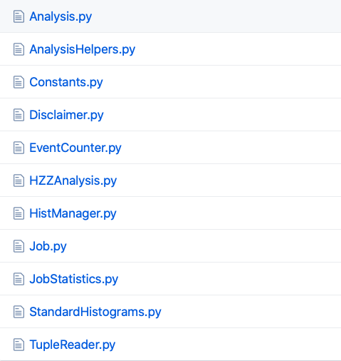
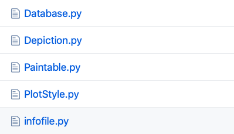
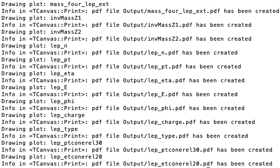

# PyROOT framework for the 13 TeV ATLAS Open Data analysis

## Introduction
The framework makes use of the [Python language](https://www.python.org) and is interfaced with [ROOT](https://root.cern.ch/), and is available under this [Github link](https://github.com/atlas-outreach-data-tools/atlas-outreach-PyROOT-framework-13tev). After cloning/downloading the repository, the only thing you need to have is Python installed. The master version of this framework uses python3. The python2 branch uses python2.

The 13 TeV ATLAS Open Data are **hosted** on the [CERN Open Data portal](http://opendata.cern.ch/) and [ATLAS Open Data portal](http://opendata.atlas.cern) in this [documentation](../datasets/files.md). The framework can access the samples in two ways:

+ reading them online directly (by default, they are stored in an [**online repository**](https://atlas-opendata.web.cern.ch/atlas-opendata/samples/2020/));
+ reading them form a local storage (the samples need to be downloaded locally).

The framework consists of **two main parts**:

+ the **analysis** part, located within the "Analysis" directory: it performs the particular object selection and stores the output histograms;
+ the **plotting** part, located within the "Plotting" directory: it makes the final Data / Prediction plots.

---

## General Usage
### Analysis
The analysis code is located in the **Analysis** folder, with files corresponding to the examples of physics analysis documented in [Physics analysis examples](../physics/intro.md). The naming of the analysis files follows a simple rule: "NNAnalysis", where NN can be *HZZ* for example.

The files in the root directory of the installation are the various run scripts. Configuration files can be found in the *Configurations* folder. 

As a first test to check whether everything works fine you can simply run a preconfigured analyis via

>     python3 RunScript.py -s "Zmumu"

What you have done here is to run the code in single core mode and specifying that you only want to analyse the Zmumu sample 
as defined in the Configurations/HZZConfiguration.py. 
The runscript has several options which may be displayed by typing

>     python3 RunScript.py --help

The options include:

>     -a,            --analysis              overrides the analysis that is stated in the configuration file
>     -s,            --samples               comma separated string that contains the keys for a subset of processes to run over
>     -p,            --parallel              enables running in parallel (default is single core use)
>     -n NWORKERS,   --nWorkers NWORKERS     specifies the number of workers if multi core usage is desired (default is 4)
>     -c CONFIGFILE, --configfile CONFIGFILE specifies the config file to be read (default is Configurations/Configuration.py)
>     -o OUTPUTDIR,  --output OUTPUDIR       specifies the output directory you would like to use instead of the one in the configuration file

The XConfiguration.py files specify how an analysis should behave. The Job portion of the configuration looks like this:

>      Job = {
>          "Batch"           : True,              (switches progress bar on and off, forced to be off when running in parallel mode)
>          "Analysis"        : "HZZAnalysis",     (names the analysis to be executed)
>          "Fraction"        : 1,                 (determines the fraction of events per file to be analysed)
>          "MaxEvents"       : 1234567890,        (determines the maximum number of events per file to be analysed)
>          "OutputDirectory" : "resultsHZZ/"      (specifies the directory where the output root files should be saved)
>      }

The second portion of the configuration file specifies 
the locations of the individual files that are to be used for the different 
processes can be set as such:

>     Processes = {
>         # H -> ZZ -> 4lep processes
>         "ggH125_ZZ4lep"         : "https://atlas-opendata.web.cern.ch/atlas-opendata/samples/2020/4lep/MC/mc_345060.ggH125_ZZ4lep.4lep.root", (single file)
>         ...
>     }

The names chosen for the processes are important as they are the keys that are used later in the _infofile.py_ to determine the necessary 
scaling factors for correct plotting. 

Now we want to run over the full set of available samples. For this simply type:

>     python3 RunScript.py

Use the options -p and -n if you have a multi core system and want to use multiple cores.
Execution times are ~ 40 minutes in single core mode or ~ 25 minutes in multi core mode with 4 nodes.

If everything was successful, the code will create in the results directory (**resultsNN**) a new file with the name of the corresponding sample (data_A, ttbar_lep,...).

### Plotting

The plotting code is located in the **Plotting** folder and contains the following files:

+ Histogram manipulation (**Database.py**): The functionality found here implements a metadata database used to manipulate the histograms;
+ Plot variaties (**Depiction.py**): Depictions define certain standardized plot varieties;
+ Paintable definitions (**Paintable.py**): splits the problem of plotting something into logical pieces;
+ Plot style (**PlotStyle.py**): The general style that is to be applied is defined here;
+ infofile (**infofile.py**): MC sample name, DSID, number of events, reduction efficiency, sum of weights and cross-section.

Results may be plotted via:

> python3 PlotResults.py Configuration/PlotConf\_AnalysisName.py

In our example case the name of the analysis is *HZZAnalysis*, so type:

> python3 PlotResults.py Configuration/PlotConf\_HZZAnalysis.py

The resulting histograms will be put into the _Output_ directory.

The plotting configuration file enables the user to steer the plotting process.
Each analysis has its own plotting configuration file to accomodate changes in background composition or histograms that the user may want to plot.

General information for plotting include the _Luminosity_ and _InputDirectory_ located at the top of the file:

>       config = {
>           "Luminosity"     : 10064,
>           "InputDirectory" : "resultsHZZ",
>           ...

The names of the histograms to be drawn can be specified like so: 

>      "Histograms" : {
>      ...    
>          "invMassZ1"       : {"rebin" : 3},
>          "invMassZ2"       : {"rebin" : 3},
>	   "lep_n"           : {"y_margin" : 0.4},
>      ...

Note that it is possible to supply additional information via a dictionary like structure to further detail the per histogram options.
Currently available options are:

>     rebin    : int   - used to merge X bins into one. Useful in low statistics situations
>     log_y    : bool  - if True is set as the bool the main depiction will be drawn in logarithmic scale
>     y_margin : float - sets the fraction of whitespace above the largest contribution in the plot. Default value is 0.1.

#### Definition of Paintables and Depictions
Each Plot consists of several _depictions_ of _paintables_.
A depiction is a certain standard type of visualising information. Availabe depictions include simple plots, ratios and agreement plots.
A paintable is a histogram or stack with added information such as colors and which processes contribute to said histogram.
A simple definition of paintables may look like this:

>     'Paintables': {
>         "Stack": {
>             "Order"     : ["Other","ZZ","HZZ"],
>             "Processes" : {                
>                 "HZZ" : {
>                     "Color"         : "#ff0000",
>                     "Contributions" : ["ggH125_ZZ4lep","VBFH125_ZZ4lep","WH125_ZZ4lep","ZH125_ZZ4lep"]},
>                 ...
>         },
>     
>         'Higgs': {
>             'Color': '#0000ff', 
>             'Contributions': ['ggH125_WW2lep']},
>                 
>         "data" : {
>             "Contributions": ["data_A", "data_B", "data_C", "data_D"]}

_Stack_ and _data_ are specialised names for _paintables_. This ensures that only one stack and one data representation are present in the visual results.
A _Stack_ shows the different processes specified in "order" stacked upon each other to give an idea of the composition of the simulated data.
The definitions for these individual processes are defined under "Processes". Each process has a certain colour and a list of contributing parts 
that comprise it. These contributing parts have to fit the keys used in both the run configuration and the _infofile.py_.

_data_ is a specialised _paintable_ which is geared toward the standard representation of data. Since the data does not need to be scaled there is no need
to align the used names in contributions with those found in the _infofile.py_. However, they still have to fit the ones used in the _configuration.py_.

All otherwise named paintables (like "Higgs" in the example) are considered as "overlays". Overlays are used to show possible signals or to compare shapes
between multiple overlays (for instance in a HWWAnalysis).

The paintables can be used in depictions like so:

>     "Depictions": {
>         "Order"       : ["Main", "Data/MC", "S/B"],
>         "Definitions" : {
>             "Data/MC": {
>                 "type"       : "Agreement",
>                 "Paintables" : ["data", "Stack"]},
>             
>             "Main": {
>                 "type"      : "Main",
>                 "Paintables": ["Stack", "data"]},
>     
>             'S/B': {
>                 'type'       : 'Ratio',
>                 'Paintables' : ['Higgs', 'Stack']},
>         }

There are currently three types of depictions available: _Main_, _Agreement_ and _Ratio_.
Main type plots will simply show the paintables in a simple plot fashion.
Ratio type plots will show the ratio of the first paintable w.r.t. the second paintable.
Agreement type plots are typically used to evaluate the agreement between two paintables (usually the stack of predictions and the data).

The order of the depictions is determined in line 2 of the code example above.

If everything was successful, the code will create in the output directory (**Output**) the corresponding plots defined in **Configurations/PlotConf\_AnalysisName.py**.

## In Depth Information

### Analysis Code
The analysis code is located in the _Analysis_ folder.
It will be used to write out histograms for the individual input files which
will be used for plotting purposes later.

The basic code implementing the protocol to read the files and how the objects can be read is in _TupleReader.py_.
Have a look there to see which information is available.
The general analysis flow can be found in _Job.py_ whereas the base class for all concrete analyses is located in  _Analysis.py_.

It is recommended to start out by modifying one of the existing analyses, e.g. the HZZAnalysis located in _HZZAnalysis.py_.
If you want to add an analysis, make sure that the filename is the same as the class name, otherwise the code will not work.

## Analyses 

Analyses that have been implemented: HZZ

# Navigation
Go to the [next framework]( "RData-based framework"), jump back to the [previous framework]( "Python uproot based framework") or jump back to the [summary page for the analysis frameworks]( "Summary page") or the [general summary page]( "Summary page").