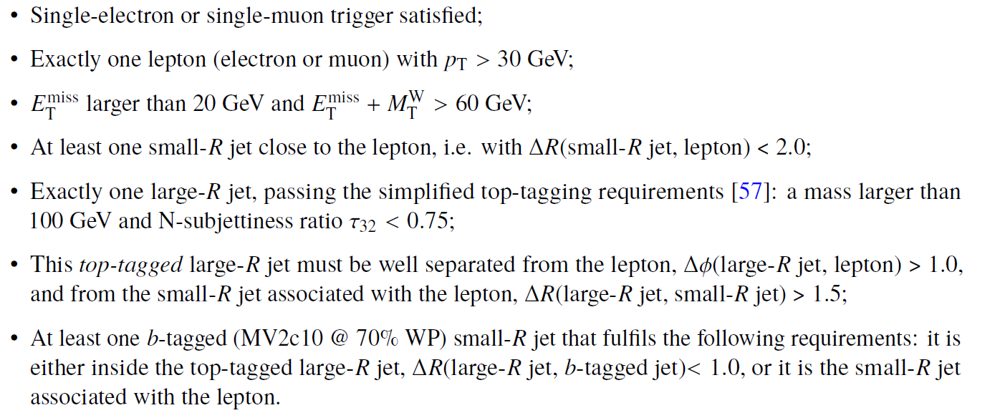
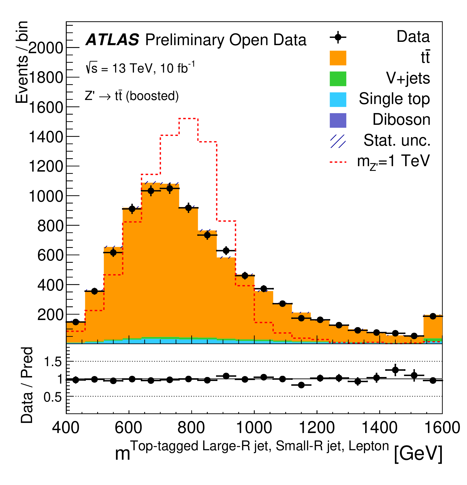

Despite the spectacular phenomenological and experimental success of the SM, searches for new physics phenomena at the LHC are constantly ongoing. As an example, with a mass close to the scale of electroweak symmetry breaking, the top quark, besides having a large coupling to the SM Higgs boson, is predicted to have large couplings to new particles hypothesised in many BSM models.

In the following, we focus on implementing the selection criteria of a search for new heavy particles that decay into top-quark pairs in events containing a single charged lepton, large-R jets and missing transverse momentum. A particular benchmark model chosen for this search produces a new gauge boson Z' with a mass of 1 TeV and width of 10 GeV that decays into a tt-pair

In order to identify these events, one needs to apply the standard object-selection criteria (defined in "Reconstructed physics objects"), with a stricter lepton pT requirement and tight lepton identification criteria, and an event-selection criteria defined as:





At the end, one is able to compare data and MC prediction for the distribution of e.g. the approximate mass of the tt system, as seen below. The benchmark 1 TeV Z' model is overlaid, clearly showing the different kinematic properties of this particular BSM prediction.





# Navigation
Go to the [previous example]( "Z boson decaying into two tau leptons 13 TeV"), the [next example]( "Higgs to gamma gamma channel") or jump back to the [summary page for the analysis examples]( "Summary page") or the [general summary page]( "Summary page").