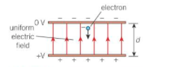

# Curriculum links

## Conservation of energy

Conservation of energy is the principle that energy cannot be created or destroyed. Like charge, energy is a conserved quantity. Take care not to confuse 'conservation of energy’ with ‘conservation of energy resources’.

## Conservation of momentum

Conservation of momentum is the law of physics that says the total momentum of a system remains constant. Momentum is equal to the mass of an object multiplied by its velocity. Equivalent to the force required to bring an object to a stop in a unit length of time. For any array of several objects, the total momentum is the sum of the individual momenta.

## Electromagnetic waves

Transverse waves made up of electric and magnetic fields oscillating at right angles are known as electromagnetic waves. The two oscillations of non-conducting materials are in phase (they both go to zero at the same time). In the air, the speed is very close to that of vacuum (\\(3 \times 10^{8} ms^{-1}\\)).

## Particle acceleration

When talking about particles accelerating towards each other it’s useful to demonstrate the physics of it using a more manageable scale experiments, for example the electron gun.





In most cases a small metal filament is heated by an electric current. The electrons in this piece of wire gain Kinetic energy.
If the heated filament is placed in a vacuum and a high p.d applied between the filament and an anode, the filament acts as a cathode, and the freed electrons accelerate towards the anode, gaining kinetic energy. If the anode has a small hole in it, the electrons in line with this holre cn pass through it, creating a [beam](http://opendata.atlas.cern/release/2020/documentation/atlas/GLOSSARY.html) with a specific kinetic energy.
 
Thinking about this we can also infer from the definition of p.d, the work done on a single electron travelling from cathode to the anode is equal to [eV](http://opendata.atlas.cern/release/2020/documentation/atlas/GLOSSARY.html), where e is the elementary charge, the charge on each electron, and V is the accelerating p.d.

By considering the law of conservation of energy we can derive an expression relating the work done on the electron to its increase in kinetic energy.

Work done on electron = Gain in Kinetic energy.

The greater the p.d the more energy transferred to the electrons and so the faster they move.

Although the particles in the LHC or ATLAS accelerator are not accelerated using a heat wire and a tube we can apply the same laws of physics to them.

Charged particles, such as electrons, can be accelerated by electric fields. 

A moderate electric field produced by a 1.5V cell can accelerate electrons to speeds of about \\(700 km^{-1}\\).

Imagine what can be done with greater accelerating voltages!- A linear particle accelerator uses electric fields to accelerate protons to speeds close to the speed of light with KE’s up to 400 MeV.

We can see this being displayed in this diagram





 The electron here is accelerated by the electric field as it travels towards the positive plate.

### Acceleration 

Being negatively charged the particle (electron) is repelled by the negative plate, and goes towards the positive plate in the opposite direction of the electric field.
This suggests the electron here will experience a constant electrostatic force due to the uniform electric field  between the plates, so it has an acceleration.

### Recap: Why do want we want to accelerate particles?

the ability to accelerate particles to the point where they annihilate each other means when releasing energy and mass  from the collision you could then observe with a series of special monitors.

# Navigation

Go to the [next section]( "The Higgs Boson") or jump back to the [summary page]( "Summary page").