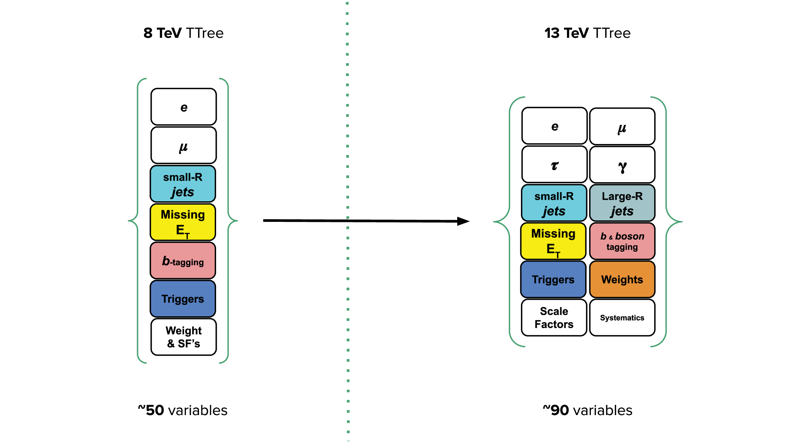

The evolution of the ATLAS Open Data and the tuple structure from the 8 TeV release in 2016 to the 13 TeV release are depicted below: 





# Navigation

Go to the [previous section]( "Limitations of the released 13 TeV Open Datasets") or jump back to the [summary page]( "Summary page").