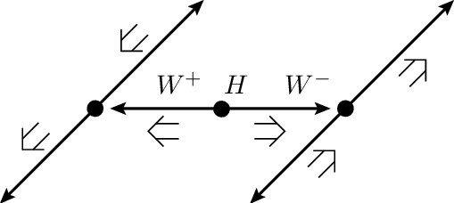
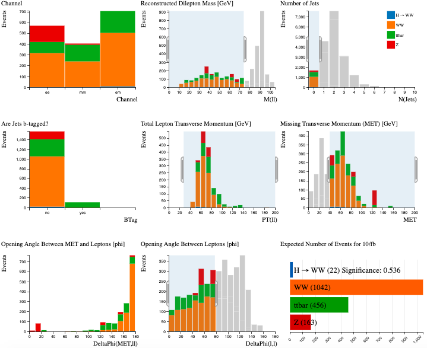
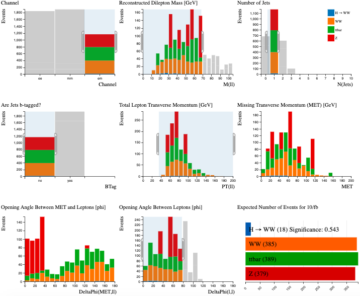

# Example: Find the Higgs

Follow the steps of a real ATLAS analysis using Histogram Analyser

## Recap: What is the Higgs Boson?

The Higgs boson is a fundamental particle that is the carrier for the Higgs field – a field that gives particles their mass. The more a particle interacts with the Higgs field, the heavier it is.

## Higgs Decay:

\\(H\rightarrow W^+W^- \rightarrow \ell^+ \ell^-\nu  \bar \nu\\) 

(\\(\ell\\) = lepton = electron or muon)

We are looking for a Higgs boson which [decays](http://opendata.atlas.cern/release/2020/documentation/atlas/GLOSSARY.html) into two \\(W\\) bosons which subsequently decay into leptons and neutrinos.

* Electrons leave a track in the Pixel/SCT detector and Transition radiation detector, and deposit their energy in the electromagnetic calorimeter.
* Neutrinos don’t leave a trace in the detector but can be found using Missing Transverse Momentum (by adding up the energies and momentum after the collision we can see that any momentum that is not in the right plane doesn’t conserve momentum so this must be attributed to a neutrino or new particle.)

The major background contributions to the search in this decay mode are top (top quark pair and W+top quark), \\(WW\\) and \\(Z\\)+[jets](http://opendata.atlas.cern/release/2020/documentation/atlas/GLOSSARY.html) [events](http://opendata.atlas.cern/release/2020/documentation/atlas/GLOSSARY.html). So we need to adjust our cuts to reduce the significance of these background events. These cuts help us find the Higgs due to the laws of conservation. As spin, charge, mass and momentum all need to be conserved, we can reconstruct particles from their decays.

## Curriculum learning objective: Particle physics

Rules of conservation (spin, lepton number, charge...) must be taken into account for particle decays.

**Use the cursor to implement the following cuts, one by one.  
As you apply the cuts, you should see the distributions changing.**

Try to understand why each of the distributions change.  Think of the physics motivating the cuts.

**To clear your selection on a specific histogram click on the white background within the histogram area. **

**To clear all your selections, reload the webpage where you're using the Histogram Analyser**

Now let's try to separate the [signal from the background](http://opendata.atlas.cern/release/2020/documentation/atlas/GLOSSARY.html) using Histogram Analyser

## Curriculum Learning Objective: Introduction to quarks

Jets are produced by quarks.

## Curriculum Learning Objective: Charged particles in an electric/magnetic field

Magnetic fields are used to bend the tracks in order to measure charge and momentum of particles.

## Curriculum Learning Objective: Conservation of momentum

By adding up the energies and momentum after the collision any momentum that is not in the right plane doesn’t conserve momentum so this must be attributed to a neutrino or new particle.

## Higgs boson + 0 jet

We want to select events which contain two leptons, high missing [transverse momentum](http://opendata.atlas.cern/release/2020/documentation/atlas/GLOSSARY.html) and no jets.

Select:

* Number of Jets = 0 : We have decided this analysis is specifically with zero jets.

* Reconstructed Dilepton Mass &lt; 75 [GeV](http://opendata.atlas.cern/release/2020/documentation/atlas/GLOSSARY.html) : The \\(Z\\) events are the major background in this analysis.  The \\(Z\\) boson has a mass of 91 GeV, which is reconstructed from the mass of the two leptons.  Requiring Reconstructed Dilepton Mass to be less than 75 GeV removes over 90 % of the Z events. GeV represents Giga electron volt. The electron volt is the unit of energy used at a subatomic scale. 1eV is equal to the energy transferred to/from an electron when it moves through a potential difference of 1V.

* Total Lepton Transverse Momentum &gt; 30 GeV : For \\(Z\\) boson events, the total lepton transverse momentum peaks at zero since the transverse momenta of both leptons cancel each other.  For \\(H\rightarrow WW\\), the opening angle between leptons tends to be small, so the total lepton transverse momentum tends to be greater than zero as the momenta do not cancel out. Therefore, by cutting out the small transverse momentum, we reduce the Z events but keep most Higgs events.

* Missing Transverse Momentum &gt; 40 GeV : This cut should remove \\(Z\\) background since there tends to be little missing transverse in \\(Z\\) events.  \\(Z\\) boson decays to charged leptons do not have any neutrinos in the final state while the other processes do. This is because of the conservation of charge. Momentum is measured by using magnetic and electric fields. As leptons are charged, their path is bent by the magnetic field. A high momentum particle is bent a small amount, and a low momentum particle will be bent a large amount

* Opening Angle between Leptons &lt; 80 : We know that the opening angle between leptons for \\(H\rightarrow WW\\) tends to be small whereas for Z events the opening angle tends to be large. So cutting the large lepton angles removes some Z. This is due to the spin (an angular momentum of elementary particles *definition could be included in a hover-over box*) on the Higgs Boson and its decay particles. A Higgs Boson has 0 spin and a W Boson has a spin of 1. The directions of W Boson spins should be opposite in order to cancel out to produce a spin of 0 for the Higgs. The decay particles for these W Bosons will be electrons/muons and neutrinos, which all have a spin of ½ and will all be travelling practically parallel to each other, as matter prefers to have spin in the same direction as the direction of travel, and antimatter in the opposite direction. This means there will be a small opening angle.





The dominant background after all these cuts in the  
Higgs boson + 0 jet channel comes from \\(WW\\) and \\(Z\\)+jets.

22 Higgs events are identified, yielding a significance of 0.536

## Higgs boson + 1 jet

Select:

* Number of Jets = 1 
* no b-tagged jets. (This is to remove the top quark into two bottom quark decay)
* electron-muon channel only
* Reconstructed Dilepton Mass &lt; 70 GeV
* Total Lepton Transverse Momentum &gt; 30 GeV
* Opening angle between leptons &lt; 80

The dominant background after all these cuts in the  
Higgs boson + 1 jet channel comes from \\(WW\\) and top pair  
production.

18 Higgs events are identified, yielding a significance of 0.543.

## Have a go yourself!

Perhaps try the \\(H\rightarrow W^+W^-\\) + 0 jet, but separate it into leptonic channels and tune the cuts to maximise the number of \\(H\rightarrow W^+W^-\\) events with maximum significance.

Or try something completely different...

## Recap: What \\(H\rightarrow W^+W^-\\) decay are we looking for?

Lepton, anti-lepton, neutrino, anti-neutrino.

## Glossary:
* Channel: The leptonic decay channels are shown here: dielectron (ee), dimuon (μμ), and electron-muon (eμ)
* Reconstructed Dilepton Mass (M(ll)): the mass reconstructed from the two leptons in the final state.
* Number of Jets (N(Jets)): number of jets in the event.
* Are Jets b-tagged? (BTag) : jets originating from b-quarks are identified and labelled, or tagged, using so-called b-tagging algorithms.
* Total Lepton Transverse Momentum (PT(ll)): this is the vectorial sum of the transverse momenta of the observed charged leptons.
* Missing Transverse Momentum (MET): MET is used to infer the presence of non-detectable particles such as the neutrino.
* Opening Angle Between MET and Leptons (DeltaPhi(MET, ll)): This is the opening angle, measured in phi (φ), between the missing transverse momentum (MET) and the two leptons.
* Opening Angle Between Leptons (DeltaPhi(l,l)): this is the angle, measured in phi (φ), between the two leptons. The azimuthal angle φ is measured from the x-axis, around the beam.
* Number of Expected Events: the number of events expected to be detected, reconstructed and recorded by ATLAS for 10 inverse femtobarn of data.  Numbers taken from simulation. The significance of the H → WW events quantifies how 'significant' the Higgs sample is with respect to the background. (Number of H → WW events)/Number of background events. The larger the significance value is, the better job you have done extracting the Higgs signal.

