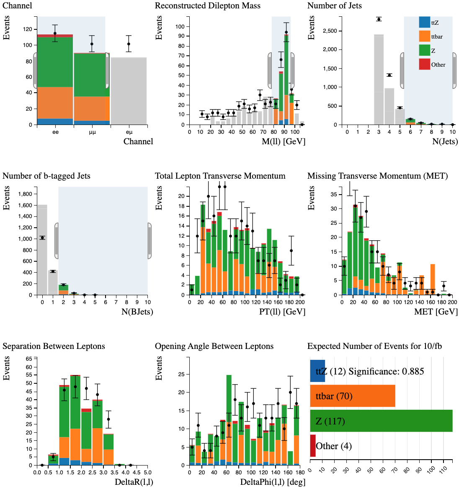
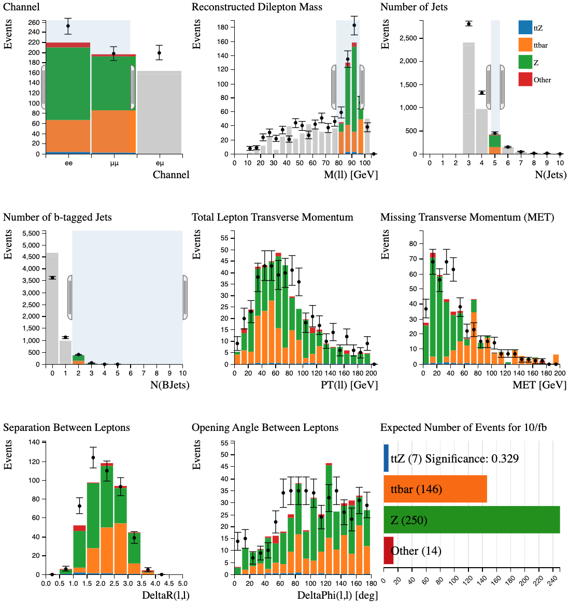

# Example: Find rare top processes

Follow the steps of a real ATLAS analysis using Histogram Analyser

\\(t\bar t Z \rightarrow \rightarrow bW^+ \bar b W^- \ell^+ \ell^- \rightarrow bq\bar q' \bar b q\bar q' \ell^+ \ell^-\\)

(\\(\ell\\) = lepton = electron or muon)

We are looking for \\(t \bar t Z\\) decays into two leptons, two b-quarks and two \\(W\\) bosons which subsequently decay into quarks.

The major background contributions to the search in this decay mode are top quark pair, and \\(Z\\)+jets events.

**Use the cursor to implement the following cuts, one by one.  
As you apply the cuts, you should see the distributions changing.**

Try to understand why each of the distributions change.  Think of the physics motivating the cuts.

**To clear your selection on a specific histogram click on the white background within the histogram area. **

**To clear all your selections, reload the webpage where you're using the Histogram Analyser**

Now let's try to separate the signal from the background using Histogram Analyser

## \\(t \bar t Z\\) with 6 jets

We want to select events which contain two leptons, low missing transverse momentum and 6 jets.

Select:

* Number of Jets at least 6 : We have decided this analysis is specifically with at least 6 jets.

* Channel \\(ee\\) and \\(\mu\mu\\) : Throwing away \\(e\mu\\) events throws away a lot of \\(t \bar t\\) but not much \\(t \bar t Z\\).

* Reconstructed Dilepton Mass between 80 and 100 GeV : \\(t \bar t\\) events are a major background in this analysis.  The \\(Z\\) boson has a mass of 91 GeV, which is reconstructed from the mass of the two leptons.  Requiring Reconstructed Dilepton Mass to be around the \\(Z\\) boson mass removes a large fraction of \\(t \bar t\\) events.

* Number of b-tagged Jets at least 2 : \\(t \bar t Z\\) decays contain similar amounts of events with 1 and 2 b-tagged jets, whereas \\(Z\\) boson decays mostly contain 0 b-tagged jets. Therefore, requiring at least 2 b-tagged jets is a worthwile cut.

The dominant background after all these cuts in the  
\\(t \bar t Z\\) with 6 jets channel comes from \\(t \bar t\\) and \\(Z\\)+jets.

12 \\(t \bar t Z\\) events are identified, yielding a significance of 0.885

## \\(t \bar t Z\\) with 5 jets

Select:

* Number of Jets = 5
* at least 2 b-tagged jets
* \\(ee\\) and \\(\mu\mu\\) channels only
* Reconstructed Dilepton Mass between 80 and 100 GeV

The dominant background after all these cuts in the  
\\(t \bar t Z\\) + 5 jets channel comes from \\(Z\\)+jets and top pair  
production.

7 \\(t \bar t Z\\) events are identified, yielding a significance of 0.329.

## Have a go yourself!

Perhaps try the \\(t \bar t Z\\) with 6 jets, but separate it into leptonic channels and tune the cuts to maximise the number of \\(t \bar t Z\\) events with maximum significance.

Or try something completely different...

# Navigation

Go to the [previous section]( "Histogram Analyser seperate signals") or jump back to the [summary page]( "Summary page").