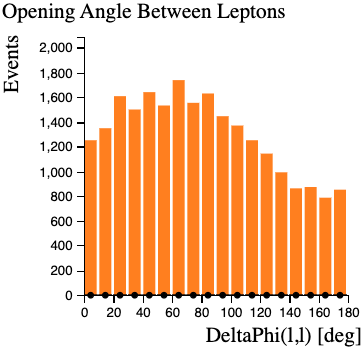

# \(t\bar t Z\) - simulated + real data

Physicists use **cuts** to select events of interest.  Cuts preferentially remove the unwanted processes (background) but leave as much as possible of the desired process (signal).  It is useful to have a good understanding of the physics processes involved when applying cuts.

We have created another Histogram Analyser, to help visualise rare top-quark data. This Histogram Analyser searches for rare top-quark processes. Data are shown by the black dots, with error bars.

The three main processes are \(t\bar t Z\), \(t\bar t\) and \(Z\).

This Histogram Analyser also includes minor backgrounds, labelled as 'Other' in red. Minor backgrounds are required for data to match the total simulation. 'Other' includes single top production, \(WZ\) and \(ZZ\) diboson production and \(t\bar t W\).

Each process is represented by a different colour in Histogram Analyser.

## Make cuts using your cursor.

Use the cursor to select a specific range in one of the histograms.
The selected ranges will be coloured, whilst non-selected ranges will be greyed out.  When you make cuts on a variable the relative contributions of the four processes will change.

**To clear your selection on a specific histogram click on the white background within the histogram area. **

**To clear all your selections, reload your page** 

## The histograms explained

Histogram Analyser displays nine histograms.  The description of each follows.

The histograms can take about 30 seconds to load. Whilst loading you'll only see the histogram titles. Once loaded you'll see the histograms appear under their titles.

We think it really helps to be able to see all nine histograms on your screen at the same time. So if this isn't the case to start with, we suggest decreasing the zoom in your web browser until you can see all nine (e.g 67%).

<iframe width="100%" height="950" src="interactive/13TeV_ttZanalyser.html" frameborder="0" allowfullscreen></iframe>

You can select just the \(t\bar t Z\) events by clicking on the \(t\bar t Z\) in the 'Expected Number of Events' histogram.

## Expected Number of Events for 10/fb

This histogram shows the number of events expected to be detected, reconstructed and recorded by ATLAS for 10 inverse femtobarn (10/fb) of data.
Ten inverse femtobarns correspond to approximately 1000 trillion proton-proton collisions.

The expected number of events reconstructed and recorded by ATLAS is different to the number of events produced.
Some events will not be reconstructed due to the way the detector is constructed, the resolution of the sub-detectors, reconstruction efficiency and other inefficiencies.

With no cuts, we have 75 \(t\bar t Z\) events, with many more background events.  The majority of the background is \(Z\) boson production.

The **significance** of the \(t\bar t Z\) events quantifies how "significant" the \(t\bar t Z\) sample is with respect to the background.  It is calculated by \((\text{Number of } t\bar t Z \text{events}) / \sqrt{\text{Number of background events}}\)\).
**The larger the significance value is, the better job you have done extracting the \(t\bar t Z\) signal**.

## Channel

The leptonic decay channels are shown here: dielectron \(ee\), dimuon \(\mu\mu\) and electron-muon \(e\mu\).
Decays to taus or hadrons are not considered in Histogram Analyser.

## Reconstructed Dilepton Mass [GeV]

This histogram displays the mass reconstructed from the two leptons in the final state.

With no cuts, this peaks at 90 GeV, due the huge [\(Z\) boson](http://pdg.lbl.gov/2012/listings/rpp2012-list-z-boson.pdf) contribution.

We can remove a large number of \(t\bar t\) events by selecting **Reconstructed Dilepton Mass** to be between 80 and 100 GeV, whilst hardly touching our \(t\bar t Z\) signal.
The \(t\bar t Z\) sample significance increases with this cut.
It is thus a useful quantity to use to reduce the \(t\bar t\) background.

You will notice that both the data points and the simulated Monte Carlo distributions change. The data and simulated Monte Carlo are not exactly the same, but the general agreement is very good. This shows that these processes are well understood and well modelled.

## Number of Jets

Number of jets found in the event. Events with 0, 1 or 2 jets haven't been saved to make the file smaller and thus the Histogram Analyser will run quicker.

When selecting six or more jets we see that the background contributions decrease and the \(t\bar{t}Z\) contribution becomes more important. The blue \(t\bar t Z\) contribution is now more noticeable in the histograms.

## Number of b-tagged Jets?

Jets originating from \(b\)-quarks are identified and labelled, or **tagged**, using so-called b-tagging algorithms.

\(b\)-tagged jets are expected in top quark decays, but not in leptonic \(W\) or \(Z\) boson decays.

Selecting 'Number of b-tagged Jets' at least 2, the \(t\bar t Z\) contribution is now more noticeable in the histograms.

## Total Lepton Transverse Momentum [GeV]

This is the [vectorial sum](https://en.wikipedia.org/wiki/Euclidean_vector#Addition_and_subtraction) of the transverse momenta of the observed charged leptons.

For \(Z\) boson events, total lepton transverse momentum peaks at low values since the transverse momenta of both leptons mostly cancel each other.
For the other processes this cancellation is not as pronounced.
Their distributions peak at between 60 and 90 GeV.

## Missing Transverse Momentum (MET) [GeV]

In the LHC, the initial energy of the colliding partons (quarks or gluons) along the beam axis is not known.
This is due to the energy of each proton being shared and constantly exchanged between its constituents.

However, the initial momentum of particles travelling transverse to the beam axis is zero.
Therefore, any net momentum in the transverse direction indicates missing transverse momentum.

Missing transverse momentum is used to infer the presence of non-detectable particles such as the neutrino.
It is also expected to be a signature of many predicted physics events beyond the Standard Model, for example the lightest [supersymmetric](http://home.cern/scientists/updates/2013/10/supersymmetry-searches-atlas) particle.

The standard abbreviation for missing transverse momentum is MET, for historical reasons.

\(t\bar t\) decays to two leptons have two neutrinos in the final state while \(Z\) boson decays to charged leptons do not.
That is why requiring low missing transverse momentum removes \(t\bar t\) events.

In combination with other cuts, select missing transverse momentum and watch how the ratio of \(t\bar t Z\) and \(t\bar t\) to \(Z\) events changes.

## Opening Angle Between Leptons \([\phi]\)

This is the opening angle, measured in phi \(\phi\), between the two leptons.
The azimuthal angle \(\phi\) is measured from the \(x\)-axis, around the beam.

In the event display above, two lepton tracks are displayed in red and the opening angle between the two leptons is marked in blue.

If the leptons are emitted back-to-back, this is displayed on the histogram as 180 degrees.
\(Z\) events show a peak at high values in contrast to all other processes.

## Separation Between Leptons

Separation, \((\Delta R)\), is calculated using the following equation:

\((\Delta R)^2 = (\Delta\phi)^2 + (\Delta\eta)^2\)

where \(\phi\) is the azimuthal angle between leptons and \(\eta\) is the [pseudorapidity](http://opendata.atlas.cern/release/2020/documentation/atlas/GLOSSARY.html). 

\(t\bar t Z\) events show a peak at lower values than other processes.

## Your challenge

Make some selections to separate the \(t\bar t Z\) signal from the background.

Can you increase the significance to over 0.9?

Below is an event display, where a \(t\bar t Z\) candidate has been identified decaying into 2 muons and a number of jets.

