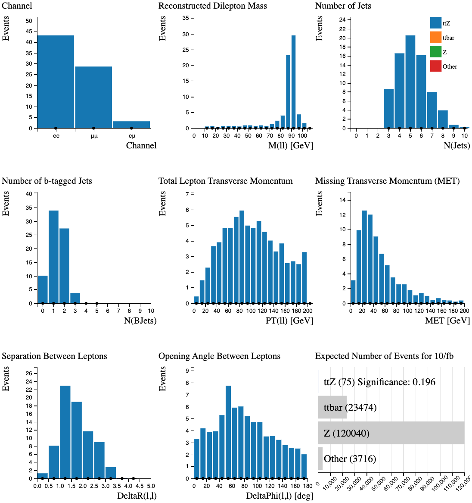
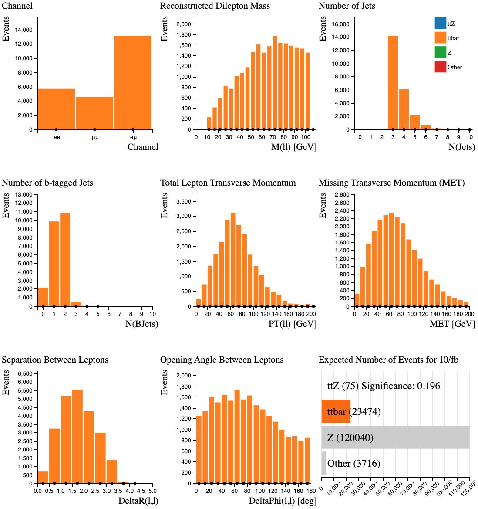
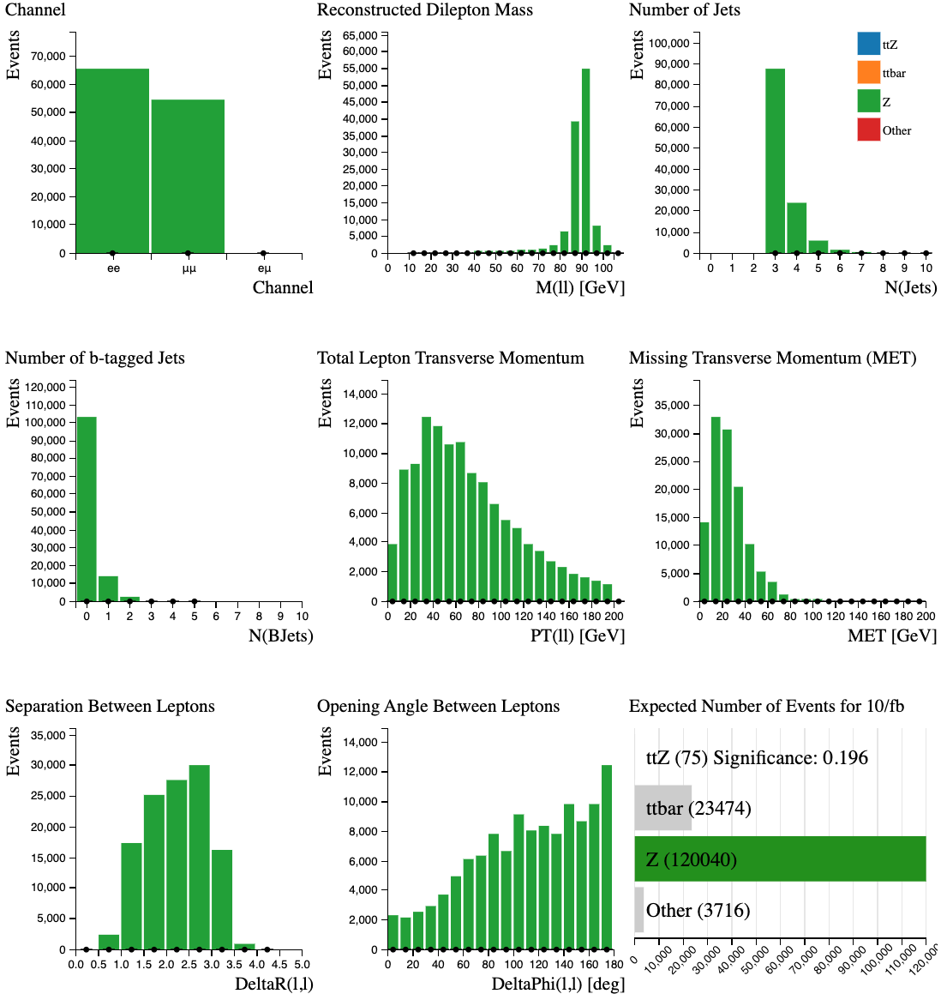

# Separate Signals

Using the Histogram Analyser we can look at each sample separately and understand a little more about their characteristics.  
This will help us separate our signal from the background later.

**Select the sample by clicking on the bar in the Expected Number of Events histogram.**  
The rest of the histograms now just display the characteristics of your chosen sample.

## \\(t \bar t Z\\)

\\(t\bar t Z \rightarrow \rightarrow bW^+ \bar b W^- \ell^+ \ell^- \rightarrow bq\bar q' \bar b q\bar q' \ell^+ \ell^-\\)

( \\(\ell\\) = electron, muon)

Our signal is the \\(t \bar t Z\\) which decays into two \\(W\\) bosons, two b-quarks and two leptons. The \\(W\\) bosons subsequently decay into quarks.

Let's look at the individual histograms:

* The events occur in the di-electron and di-muon channels.
* The reconstructed mass from the two leptons peaks at 90 GeV. 
* The majority of \\(t \bar t Z\\) events contain 5 or more jets.
* The majority of \\(t \bar t Z\\) events contain 1 or 2 b-tagged jets. 
* The total lepton transverse momentum peaks around 80 GeV.   
* The total missing transverse momentum tends to be small.
* The separation between leptons peaks around 1-1.5.
* The opening angle of the leptons from top quark production is fairly evenly distributed over the whole \\(\phi\\) range, tending to slightly smaller values.

## top quark pair production (\\(t \bar t\\))

The top quark is the heaviest subatomic particle ever observed, with a mass that is about as heavy as an entire atom of gold. Top quarks are also among the most fleeting of particles, with a lifetime of about a trillionth of a trillionth of a second.

Due to its high mass and short lifetime, the top quark provides a unique environment to study a bare quark.

Looking at the individual histograms:

* The events occur in all three channels. 
* The reconstructed mass from the two leptons is much smoother than the reconstructed mass from the two leptons in \\(t \bar t Z\\).
* The majority of \\(t\bar t\\) events contain 3 jets.
* Most events contain 1 or 2 b-tagged jets. 
* The total lepton transverse momentum peaks around 60-70 GeV.  
* Missing transverse momentum is due to the neutrinos in the final state.
* The separation between leptons peaks around 1.5-2.
* The opening angle of the leptons from top quark production is fairly evenly distributed over the whole \\(\phi\\) range, tending to slightly smaller values.

Therefore demanding

* events in the \\(ee\\) and \\(\mu\mu\\) channels,
* reconstructed mass from the two leptons around 90 GeV,
* 6 or more jets and
* a low missing transverse momentum

will reduce the top quark contribution.

## \\(Z\\)

Looking at the individual histograms:

* The events occur in the di-electron and di-muon channels. 
* The reconstructed mass from the two leptons peaks at around 90 GeV.
* The majority of events contain 3 jets.
* Most events don't have b-tagged jets. 
* The total lepton transverse momentum peaks around 30-40 GeV.  
* The total missing transverse momentum tends to be small.
* The separation between leptons is rather flat between 1.5 an 3.
* The opening angle of the leptons tends to be large (back-to-back) 

\\(t \bar t Z\\) decays often contain 6 jets, whereas \\(Z\\) boson decays tend to contain fewer jets. Requiring at least 6 jets is an important cut to remove \\(Z\\) boson background from our \\(t \bar t Z\\) signal.

# Navigation

Go to the [previous section]( "Histogram Analyser rare top-quark processes"), the [next section]( "Find the rare top") or jump back to the [summary page]( "Summary page").