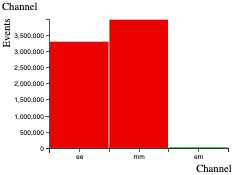
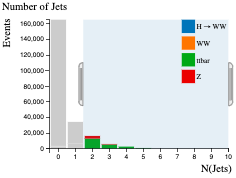
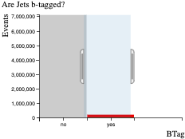
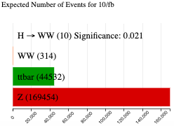
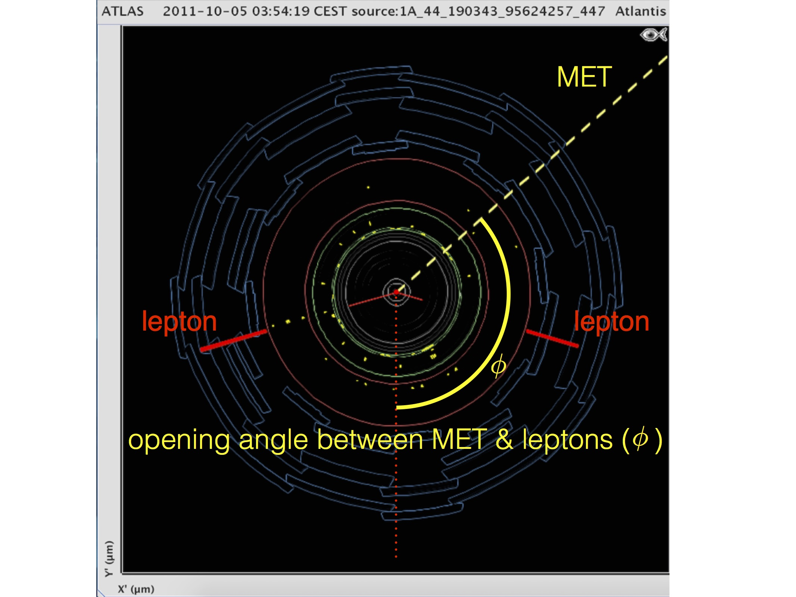

# Histogram Analyser

## Recap: What is the major difference between a histogram and a bar graph?

The x variable of a histogram is continuous, grouped into **ranges or ‘bins’**.

Physicists use **cuts** to select events of interest.  Cuts preferentially remove the unwanted processes (background) but leave as much as possible of the desired process (signal).  It is useful to have a good understanding of the physics processes involved when applying cuts.

We have created two Histogram Analysers, to help visualise the data:
The first Histogram Analyser displays just simulated (MC) events.  
The second Histogram Analyser displays both real data and simulated events.  

Both histogram analysers display four physics processes.  These are: \\(H\rightarrow W^+W^-\\), \\(WW\\), \\(t\bar t\\) and \\(Z\\).  Each process is represented by a different colour in Histogram Analyser. A more in depth discussion of them can be found in the next chapter. 

## Make cuts using your cursor.

Use the cursor to select a specific range in one of the histograms. These will be coloured, whilst non-selected ranges will be greyed out.  When you make cuts on a variable, the relative contributions of each of the four processes will change.

**To clear your selection on a specific histogram:** click on the white background within the histogram area. 

**To clear all your selections:** click on "Histogram Analyser" under Get Started in the main top menu.

## The histograms explained

**Higgs to WW - simulated data**
Histogram Analyser displays nine histograms.  The description of each follows.

The histograms can take about 30 seconds to load. Whilst loading you'll only see the histogram titles. Once loaded you'll see the histograms appear under their titles.

We think it really helps to be able to see all nine histograms on your screen at the same time. So if this isn't the case to start with, we suggest decreasing the zoom in your web browser until you can see all nine (e.g 67%).


<html lang="en">
  <head>
    <title>Crossfilter for ATLAS Outreach Prototype</title>
    <meta charset="UTF-8">
    <link rel="stylesheet" type="text/css" href="interactive/dc.css"/>
  </head>
  

  <body>
    

<table style="width:50%">
  <tr style="height: 50px">
    <td valign="bottom">Channel</td>
    <td valign="bottom">Reconstructed Dilepton Mass</td>
    <td valign="bottom">Number of Jets</td>
  </tr>
  <tr>
    <td>

</td>
    <td>

</td>
    <td>

</td>
  </tr>
  <tr style="height: 50px">
    <td valign="bottom">Are Jets b-tagged?</td>
    <td valign="bottom">Total Lepton Transverse Momentum</td>
    <td valign="bottom">Missing Transverse Momentum (MET)</td>
  </tr>
  <tr>
    <td>

</td>
    <td>

</td>
    <td>

</td>
  </tr>
  <tr style="height: 50px">
    <td valign="bottom">Opening Angle Between MET and Leptons</td>
    <td valign="bottom">Opening Angle Between Leptons</td>
    <td valign="bottom">Expected Number of Events for 10/fb</td>
  </tr>
  <tr>
    <td>

</td>
    <td>

</td>
    <td>

</td>

 </table>

    
    
    
    

  </body>
</html>


**Would you like to make more detailed cuts, increase the number of bins, or include a larger set of data?** Try [coding your data analysis](https://github.com/atlas-outreach-data-tools/notebooks-collection-opendata)!

## Expected Number of Events for 10/fb

This histogram shows the number of events expected to be detected, reconstructed and recorded by ATLAS for 10 inverse femtobarn (10/fb) of data.  
Ten inverse femtobarns correspond to approximately 1000 trillion proton-proton collisions.

The expected number of events reconstructed and recorded by ATLAS is different to the number of events produced.  
Some events will not be reconstructed due to the way the detector is constructed, the resolution of the sub-detectors, reconstruction efficiency and other inefficiencies.

With no cuts, we have 124 \\(H\rightarrow W^+W^-\\) events, with a total background of 7342087 events.  The majority of the background is \\(Z\\) boson production.

The **significance** of the  \\(H\rightarrow W^+W^-\\) events quantifies how "significant" the Higgs sample is with respect to the background.  It is calculated by \\((\text{Number of } H\rightarrow W^+W^- \text{events}) / \sqrt{\text{Number of background events}}\\).  
**The larger the significance value is, the better job you have done extracting the Higgs signal**.

## Channel

The leptonic decay channels are shown here: dielectron \\(ee\\), dimuon \\(mm\\) and electron-muon \\(em\\).  
Decays to taus or hadrons are not considered in Histogram Analyser.

Histogram Analyser showing just simulated data, displays three leptonic channels.  Histogram Analyser showing simulated and real data, displays just the electron-muon channel, so this histogram is not displayed.

## Reconstructed Dilepton Mass [GeV]

This histogram displays the mass reconstructed from the two leptons in the final state.

With no cuts, this peaks at 90 GeV, due the huge [\\(Z\\) boson](http://pdg.lbl.gov/2012/listings/rpp2012-list-z-boson.pdf) contribution.

  

We can remove a large number of \\(Z\\) boson events by selecting **Reconstructed Dilepton Mass** to be less than 75 GeV, whilst hardly touching our Higgs signal.  
The \\(H\rightarrow W^+W^-\\) sample significance increases from 0.046 to 0.250 with this cut.  
It is thus a useful quantity to use to reduce the huge \\(Z\\) boson background.

## Number of Jets

Number of jets found in the event.

When selecting two or more jets we see that the \\(Z\\) boson contribution decreases (from 7281608 to 1527242) and the \\(t\bar{t}\\) contribution becomes more important.

Selecting two or more jets, the ratio of ttbar to \\(Z\\) events increases from 49730/7281608 = 0.0007 to 36958/1527242 = 0.02 and the green ttbar contribution is now noticeable in the histograms.

Top-quark pair production leads to \\(WW\\)+jets final states.

## Are Jets b-tagged?

Jets originating from \\(b\\)-quarks are identified and labelled, or **tagged**, using so-called b-tagging algorithms.

   
  

\\(b\\)-tagged jets are expected in top quark decays, but not in leptonic \\(W\\) or \\(Z\\) boson decays.

Selecting 'Are Jets b-tagged' as yes, the ratio of ttbar to \\(Z\\) events increases from 49730/7281608 = 0.0007 to 44532/169454 = 0.26 and the green ttbar contribution is now noticeable in the histograms.

## Missing Transverse Momentum (MET) [GeV]

In the LHC, the initial energy of the colliding partons (quarks or gluons) along the beam axis is not known.  
This is due to the energy of each proton being shared and constantly exchanged between its constituents.

However, the initial momentum of particles travelling transverse to the beam axis is zero.  
Therefore, any net momentum in the transverse direction indicates missing transverse momentum.

Missing transverse momentum is used to infer the presence of non-detectable particles such as the neutrino.  It is also expected to be a signature of many predicted physics events beyond the Standard Model, for example, the lightest [supersymmetric](http://home.cern/scientists/updates/2013/10/supersymmetry-searches-atlas) particle.

The standard abbreviation for missing transverse momentum is MET, for historical reasons.

  

\\(Z\\) boson decays to charged leptons do not have any neutrinos in the final state while the other processes do.  
That is why requiring missing transverse momentum removes \\(Z\\) boson events.

Select missing transverse momentum and watch how the ratio of \\(WW\\) and ttbar to \\(Z\\) events changes.

## Total Lepton Transverse Momentum [GeV]

This is the [vectorial sum](https://en.wikipedia.org/wiki/Euclidean_vector#Addition_and_subtraction) of the transverse momenta of the observed charged leptons.

For \\(Z\\) boson events, total lepton transverse momentum peaks at zero since the transverse momenta of both leptons cancel each other.

  

For the other processes this cancellation is not as pronounced.  
Their distributions peak at between 30 and 80 GeV.

## Opening Angle Between Leptons \\([\phi]\\)

This is the opening angle, measured in phi \\(𝜙\\), between the two leptons.  
The azimuthal angle \\(\phi\\) is measured from the \\(x\\)-axis, around the beam.

In the event display above, two lepton tracks are displayed in red and the opening angle between the two leptons is marked in blue.

If the leptons are emitted back-to-back, this is displayed on the histogram as 180 degrees.  
\\(H\rightarrow W^+W^-\\) events show a peak at low values in contrast to all other processes.

## Opening Angle Between MET and Leptons \\([\phi]\\)

This is the opening angle, measured in phi \\(𝜙\\), between the missing transverse momentum \\(MET\\) and the two leptons.

In the event display above, missing transverse energy is displayed by the dotted yellow line.  The midline between the two lepton tracks (the direction of the vectorial sum of their transverse momenta) is represented by the dotted red line. The opening angle between the MET and leptons is shown in yellow.

Events with \\(t\bar t\\) and \\(Z\\) show a relatively flat distribution in this variable whereas \\(H\rightarrow W^+W^-\\) and \\(WW\\) peak at large values.

This is a useful discriminant to remove background events.

## Recap: Should significance be maximized or minimized?

Maximized.

# Navigation

Go to the [previous section]( "Histogram Analyser (simulation only)"), the [next section]( "Histogram Analyser (simulation + data)") or jump back to the [summary page]( "Summary page").