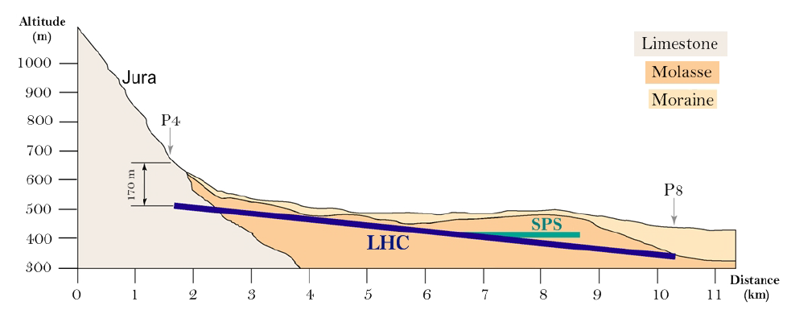

# **The Large Hadron Collider**

The main objective in a particle physics experiment is, often, to produce new particles by carrying out collisions. The choice of beam particle is governed by the particular objectives of the experiment. The particles that constitute the beam must be stable, and it should be
possible to produce and accelerate them in large numbers. Hence the most obvious choices are electrons, positrons, protons and anti-protons. The lower energy loss from synchrotron radiation is the main argument in favour of a hadron collider when a greater energy reach is the primary motivation, as is the case of the [Large Hadron Collider](https://home.cern/science/accelerators/large-hadron-collider) (LHC).

The Large Hadron Collider is a two-ring, superconducting accelerator and collider installed in a 27 km tunnel previously constructed for the Large Electron Positron (LEP) collider, located at the border of France and Switzerland and hosted by [Conseil Europeen pour la Recherche
Nucleaire](https://home.cern/) (CERN). The LHC has eight arcs and straight sections, which are approximately 528 m long. Four of the straight sections provide shelter for the LHC detectors whilst the other four are used for machine utilities, radio frequency, collimation and beam abort.

The LHC is the world's largest and most powerful particle accelerator. It first started up on 10 September 2008, and remains the latest addition to CERN's accelerator complex. The figure below shows the underground position of the LHC and the Super Proton Synchrotron (SPS), the second-largest machine in CERN's accelerator complex that measures nearly 7 kilometres in circumference.

For much more information about the LHC and the surrounding technologies, take a look at the main [CERN website](https://home.cern/science/accelerators/large-hadron-collider).

# **ATLAS detector at the LHC**

A [particle detector](https://en.wikipedia.org/wiki/Particle_detector) is a device used to detect, track, and/or identify ionising particles, such as those produced by nuclear decay, cosmic radiation, or reactions in a particle accelerator. The [ATLAS detector](http://dx.doi.org/10.1088/1748-0221/3/08/S08003) at the LHC is a multipurpose particle detector with a forward-backward symmetric cylindrical geometry and nearly full coverage in solid angle. The name ATLAS is an acronym for "A Toroidal LHC ApparatuS" given that the magnetic field is produced by [toroidal](https://en.wikipedia.org/wiki/Toroid) magnets.

The layout of the ATLAS detector is presented below:

It consists of an inner tracking detector (ID), electromagnetic and hadronic calorimeters, and a muon spectrometer. The inner detector, including the insertable B-layer, provides charged-particle tracking from [silicon pixel](https://en.wikipedia.org/wiki/Hybrid_pixel_detector) and microstrip detectors in the central region, surrounded by a [transition radiation](https://en.wikipedia.org/wiki/Transition_radiation) tracker that enhances electron identification.

The ID is surrounded by a thin [superconducting](https://en.wikipedia.org/wiki/Superconductivity) solenoid providing an axial 2 T magnetic field, and by a fine-granularity lead/liquid-argon electromagnetic [calorimeter](https://en.wikipedia.org/wiki/Calorimeter_(particle_physics)), which provides energy measurements of electromagnetic showers.

Hadron calorimetry is also based on the sampling technique, with either scintillator tiles or [liquid argon](https://atlas.cern/discover/detector/calorimeter) as the active medium and with steel, copper or tungsten as the absorber material.

An extensive muon spectrometer with an air-core toroid magnet system surrounds the calorimeters. It includes three layers of high-precision
tracking chambers. The field integral of the toroid magnets ranges from 2.0 to 6.0 Tm across most of the detector.

The ATLAS detector is split into a barrel part, where detector layers are positioned on cylindrical surfaces around the beam axis, and two end-cap parts, where detector layers are positioned in planes perpendicular to the beam pipe.

For much more information about the ATLAS detector, take a look at the [ATLAS Detector & Technology website](https://atlas.cern/discover/detector).

# Collision events seen by ATLAS

Beams of [protons](https://en.wikipedia.org/wiki/Proton) are accelerated around the [Large Hadron Collider (LHC)](https://home.cern/resources/faqs/facts-and-figures-about-lhc) and are brought to collision at the centre of the [ATLAS](http://home.cern/about/experiments/atlas) detector. The collisions produce debris in the form of new particles which fly out in all directions. Over a billion particle interactions take place in the ATLAS detector every second.

The protons within the two beams are grouped in [bunches](https://cerncourier.com/a/a-wealth-of-data-for-physics-from-the-lhc-1400-colliding-bunches-per-beam-and-counting/) which are squeezed down in size to increase the chances of a collision.
In the released data, the bunches crossed every 25 ns. The event reconstruction is affected by multiple inelastic pp collisions in a single bunch crossing and by collisions in neighbouring bunch crossings, referred to as "pile-up". The number of interactions per bunch crossing ranges from about 8 to 45.

An event is the data resulting from a particular bunch-crossing. The 13 TeV ATLAS Open Data events belong to **61 runs** from the first four periods of the 2016 pp data-taking and contain approximately **270 million** of collision events.

[Luminosity](http://home.cern/topics/high-luminosity-lhc) is one of the most important parameters of the LHC. The higher the luminosity, the more data the experiments can gather to allow them to observe rare processes. The released 13 TeV ATLAS Open Data collision events, after applying quality criteria for the beam, data and detector, correspond to an **integrated luminosity of 10.06 ± 00
.37 fb-1**.

In a typical collision event, several vertices along the beam are produced and the primary vertex is defined as the vertex with the largest sum of the squares of the transverse momenta of associated tracks. The reconstruction of vertices is important for many physics studies, which include: searches for new particles, identifying jets containing b-quarks or tau-leptons.

The event display below shows a Z-boson decaying to two muons candidate event from proton-proton collisions recorded by ATLAS with LHC stable beams at a collision energy of 13 TeV on the 29th of September 2017. The Z boson candidate is reconstructed in a beam crossing with 65 additionally reconstructed vertices. The upper left display presents a transverse view of the event (X-Y plane) where the yellow lines show the two muons' paths. The upper right display shows the 66 reconstructed vertices. The bottom display presents the event in longitudinal view (Z-Y plane). Tracks with transverse momenta large than 100 MeV are displayed.

# Navigation
Go to the next [section]( "Histogram animation") or jump back to the [summary page]( "Summary page").