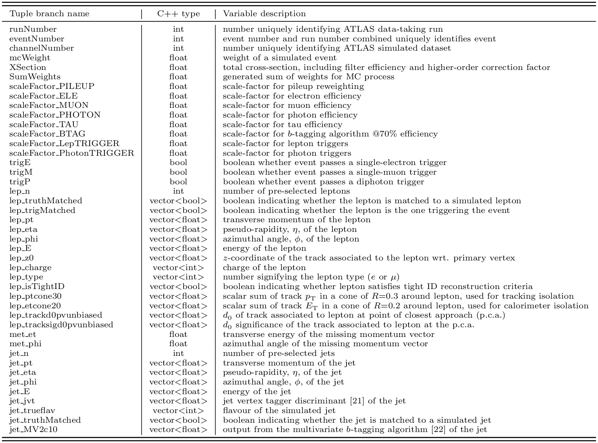
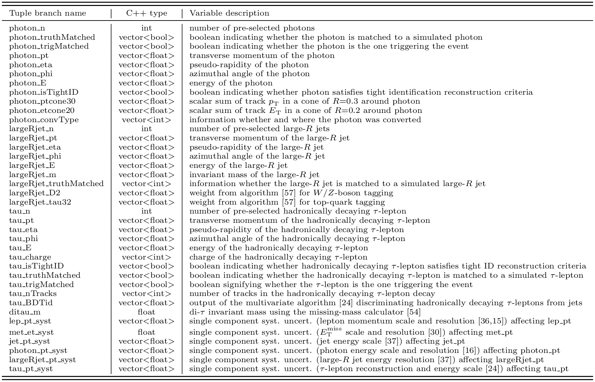

# Description of the 13 TeV ATLAS Open Data branches and variables

The **full list** of ROOT branches and variables contained within the 13 TeV ATLAS Open Data is presented below:









# Navigation
Go to the [previous section]( "Reconstructed physics objects within the 13 TeV ATLAS Open Data"), the [next section]( "Overview of the MC samples released in the 13 TeV ATLAS Open Data") or jump back to the [summary page]( "Summary page").
