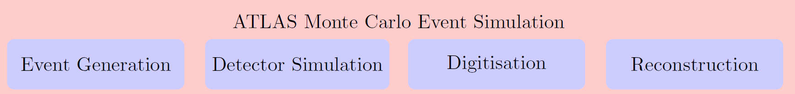

The **ATLAS simulation chain**, whose main task is to provide a realistic estimate of the ATLAS detector material properties and response to the produced events, is a chain of four well-defined steps, presented below. The chain also simulates a wide range of signal and background physics processes expected at the LHC.

The event generation using a Monte Carlo (MC) generator, which mimics the initial pp collision and encompasses its fragmentation and hadronisation stages, is followed by the simulation of the ATLAS detector geometry and material properties. Both for data and MC generated events, the digitisation step converts the currents and voltages into a response of the read-out system of the ATLAS detector, and finally the collisions are reconstructed.





The 13 TeV ATLAS Open Data set is comprised not only of pp collision data recorded with the ATLAS detector in 2016. It is accompanied by MC simulation samples describing several SM processes, which are used to model the expected distributions of different signal and background events. All simulated samples were processed through the same reconstruction algorithms and analysis chain as the data and subjected to a loose event preselection to reduce processing time.

MC simulation samples describing several Standard Model (SM) and beyond the Standard Model (BSM) processes, which are used to model the expected distributions of **different signal and background processes**, are included in the release. 

A set of simulated SM processes includes **top-quark-pair production, single-top production, production of weak bosons in association with jets (W+jets, Z+jets), production of a pair of bosons (diboson WW, WZ, ZZ) and SM Higgs production**. The basic set of SM processes is complemented by simulations of BSM processes (**heavy Z' and SUSY production**). The description of the MC samples released in the 13 TeV ATLAS Open Data is presented below: 





# Navigation

Go to the [previous section]( "13 TeV List of Branches and Variables"), the [next section]( "Datasets in ROOT format") or jump back to the [summary page]( "Summary page").