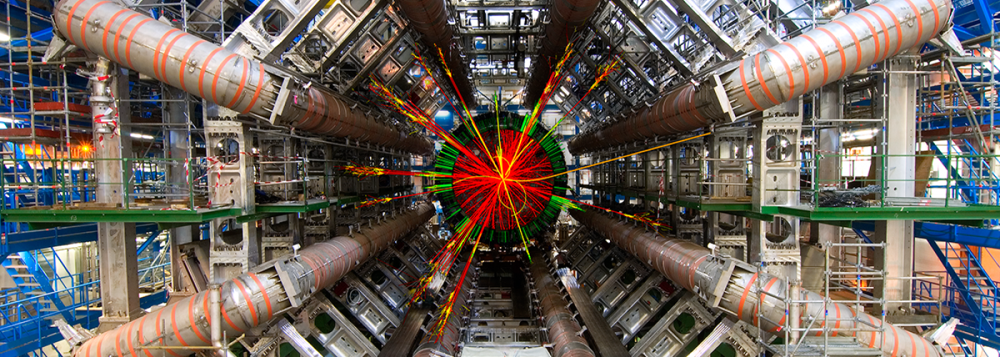

# **The ATLAS Open Data 13 TeV docs**

The aim of the 13 TeV ATLAS Open Data is to **provide data and tools** to high school, undergraduate and graduate students, as well as teachers and lecturers, to help educate and train them in analysis techniques used in experimental particle physics. Sharing data collected by the ATLAS experiment aims to generate excitement and enthusiasm for fundamental research, inspiring physicists of the future.

The following documentation provides **introductory material and detailed information** for a wide audience about the ATLAS experiment, the released 13 TeV ATLAS Open Datasets and their visualisation, the analysis frameworks and Jupyter notebooks, as well as the virtual machine usage instructions.

---

THIS STILLL NEEDS TO BE ADAPTED TO THE NEW PATHS, FIX THIS WHEN THE OTHER PAGES ARE WORKING!

### Information hosted in this web-page

Use the sections below to jump directly to the page you are interested in.
Or click [here]( "Introduction") to go on a full tour through the documentation. You can always jump back to the summary page with a link at the bottom of the page or go to the next section.

- [Introduction]( "Introduction")
- [Jupyter Notebooks]( "Jupyter Notebooks")
- [Virtual Machines]( "Virtual Machines)
- 
- [Histogram animation]( "Histogram animation")
- [Analyses]( "Analyses")
- [Set up your environment]( "Set up your environment")
- [Take a closer look to the data]( "Take a closer look to the data")
- [Take a closer look]( "Take a closer look")
- [Plots explained]( "Plots explained")
- [More plots]( "More plots")
- [Create a new plot]( "Create a new plot")
- [Event selection]( "Event selection")
- [Variable names]( "Variable names")
- [Glossary]( "Glossary")
- [Dataset details]( "Dataset details")

---

---

### General information

+ The 13 TeV ATLAS Open Data is hosted in the [ATLAS Open Data website](http://opendata.atlas.cern), as well as in the [CERN Open Data website](http://opendata.cern.ch/) and are attributed separate DOI's that allow their citation.
+ The main ATLAS-approved document meant to be a guide on the content, properties, capabilities and limitations of the released datasets is: [ATL-OREACH-PUB-2020-001](https://cds.cern.ch/record/2707171), please cite accordingly.

---
