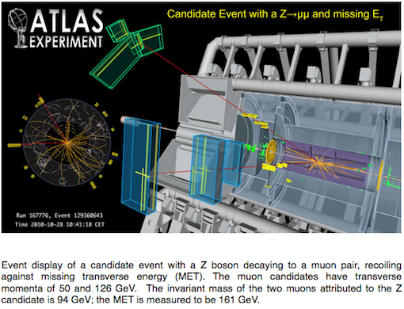

# \\(t\bar t Z\\) Analyses

The \\(t\bar t Z\\) Histogram Analyser focuses on 3 physics processes; the signal \\(t\bar t Z\\) process and 2 background processes \\(t\bar t\\) and \\(Z\\).  
Let's take a look at these processes.

## \\(t\bar t Z\\)

The [\\(t\bar t Z\\) process](http://atlas.cern/updates/physics-briefing/probes-heavyweights-standard-model) probes the interaction between heavyweights of the [Standard Model](https://home.cern/about/physics/standard-model) of particle physics, the theory that describes all known elementary particles and their interactions.

Top quarks and Z boson are some of the heaviest fundamental particles.  Thus, there are different ways to produce \\(t\bar t Z\\), and different ways for the top quarks and Z boson to decay to other particles.

One of the best ways to study \\(t\bar t Z\\) is in the alljets decay of the top-quark pair and dilepton decay of the Z boson.  This happens about 0.9% of the time.  

The signal process in the \\(t\bar t Z\\) Histogram Analyser is the \\(t\bar t Z\\) decay into 2 leptons (\\(\ell\\)) and 6 jets (2 of which should be b-tagged jets):

\\(t\bar t Z \rightarrow bq\bar q' \bar b q\bar q' \ell^+ \ell^-\\)  

(lepton = electron or muon in this case).

A key feature, or **signature** of this signal process, is an isolated high-\\(p_\text{T}\\) lepton.  The term \\(p_\text{T}\\) stands for transverse momentum, the component of momentum perpendicular to the beam line (colliding protons).  Unfortunately, the main background processes also contain isolated high-\\(p_\text{T}\\) leptons from standalone \\(t\bar t\\) or \\(Z\\) boson decays.

Often physicists refer to a particle and its antiparticle collectively by just the particle's name.  So, when we talk about quarks we mean quarks and antiquarks.  Similarly for leptons and antileptons,  neutrinos and antineutrinos.  It is a shorthand that physicists adopt for brevity.

The figure above shows a candidate collision that produced \\(t\bar t Z\\). 2 muons can be seen by the red lines. Green/blue cones indicate b-tagged jets and yellow cones indicate other jets.

Final states with leptons and missing energy are typical for many new physics models, [supersymmetry](https://home.cern/about/physics/supersymmetry) is a classic example, but also for many Standard Model processes.

Understanding the Standard Model processes possessing multiple leptons and missing energy is crucial in the quest to discover or rule out new models.

## \\(t\bar t\\)

Monte Carlo data simulation generators, QCD models and parton distribution functions are very reliant on theoretical models. Due to the very high energy of top pairs, top pair data can verify important areas of the aforementioned models and test how good the models are.

Top quark pair production is an important background in various Higgs boson analyses and beyond the Standard Model searches.  It is therefore crucial to understand this process in detail.

Top quarks decay with close to 100% probability into a W boson and a bottom quark.  The \\(W\\) in turns decays equally to a pair of leptons or a pair of quarks.  Since there are three colours for every quark the \\(W\\) boson decay to two jets is three times more probable than its decay to an electron or a muon.

The two bottom-quarks from the two top-quark decays will be seen as two jets in the final state.  
Algorithms are used to identify these jets. Jets thought to originate from \\(b\\)-quarks are called b-tagged jets.  
Additional jets in \\(t \bar t \\) events can originate from gluon radiation.

Since almost all the energy of the decay products is derived from the rest energy of the top/anti-top pair, finding the total energy of all the decay products and summing should yield the rest energy (and therefore mass) of the particles that have decayed.  But the detector can only "see" the charged particles.  It misses the neutrinos produced in the decay. 

## \\(Z\\)

The [\\(W\\)](http://home.cern/about/physics/w-boson-sunshine-and-stardust) and [\\(Z\\)](http://home.cern/about/physics/z-boson) bosons are together known as the weak or intermediate vector bosons.

At the LHC, \\(Z\\) bosons are produced by:

* **Drell-Yan **: \\( q \bar q \rightarrow Z/\gamma^* \rightarrow \mu^+\mu^-\\) (65%). A quark of one proton and an antiquark of another proton annihilate, creating a [virtual photon](https://en.wikipedia.org/wiki/Virtual_particle) or \\(Z\\) boson which then decays into a pair of oppositely-charged leptons.

* **Quark gluon scattering**: \\(qg \rightarrow qZ/γ^* \rightarrow q\mu^+\mu^-\\) (35%). A quark and a [gluon](https://en.wikipedia.org/wiki/Gluon) interact and the quark radiates a virtual photon or \\(Z\\) boson which then decays into a pair of oppositely-charged leptons.

A \\(Z\\) boson then decays into a:

* **quark-antiquark pair** (70%). These appear as jets.  If the jets are identified as originating from \\(b\\)-quarks they will be b-tagged.

* **neutrino-antineutrino pair** (20%).  Neutrinos do not interact and so are very difficult to detect.  This neutrino decay mode can sometimes be identified by missing transverse momentum.

* **lepton-antilepton pairs** (10%).  The three lepton-pair types are equally probable, electron-positron, muon-antimuon, and tau-antitau pairs.

A \\(Z\\) boson is neutral and so the sum of the charges of its decay products must be zero.

In Histogram Analyser the lepton-antilepton pair production can be studied in the electron-electron (ee) and muon-muon (mm) channel.  Decays to taus are not considered in Histogram Analyser since lectrons and muons are much easier to measure than taus.

# Navigation

Go to the [previous section]( "Rare top-quark processes"), the [next section]( "Histogram Analyser rare tops") or jump back to the [summary page]( "Summary page").