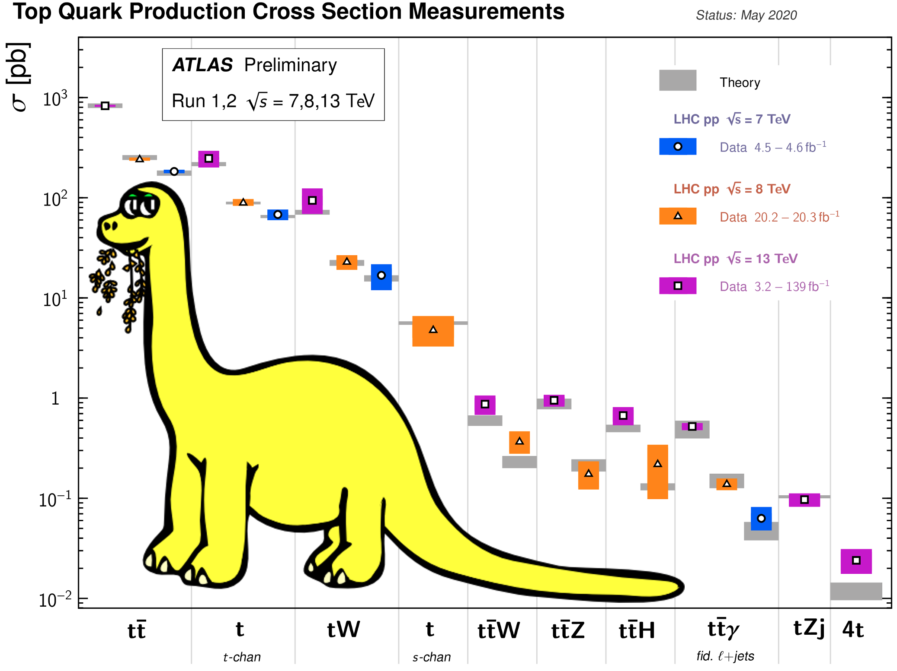
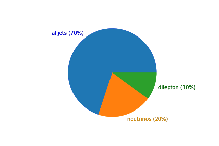
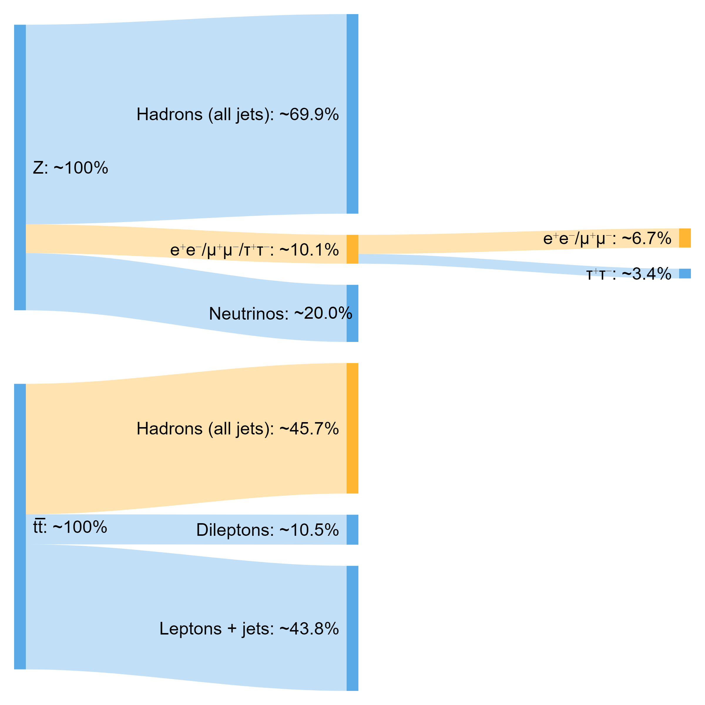

# Rare top-quark processes

The [Standard Model](http://atlas.cern/discover/physics) of particle physics is a theory that describes the known matter in terms of its elementary constituents and their interactions. It is a widely proven and very successful theory in modern physics.  

The [top quark](https://en.wikipedia.org/wiki/Top_quark) is a fundamental particle, first observed by CDF and D0 in 1995, although theorised in the 1970s. The top quark is the heaviest known fundamental particle, even heavier than the Higgs boson.

## Top quark production

Standard Model production of the top quark at the LHC is dominated by

* top-pair production: \(t\bar t\)

followed by single top production through  

* t-channel
* tW
* s-channel

Associated production is a rare process. This allows us to study the interaction of the top quark with bosons, possibly opening the door to new physics. For example, with:

* a \(W\) boson: \(t\bar t W\)
* a \(Z\) boson: \(t\bar t Z\)
* a Higgs boson: \(t\bar t H\)
* or a photon: \(t\bar t \gamma\)

Smaller contributions are expected from:

* tZj (top quark + Z boson + jet produced together)
* 4t (4 top quarks produced together)

In the following pages, we're going to be studying \(t\bar t Z\).

The figure above shows the Standard Model top quark production cross sections according to the production process, for pp collisions. Effectively, how likely each type of top-quark production is, for different processes.  The experimental uncertainties are indicated as bands [(ATLAS result)](https://atlas.web.cern.ch/Atlas/GROUPS/PHYSICS/PUBNOTES/ATL-PHYS-PUB-2020-012/). A figure like this is sometimes called a “dino plot", because it sort of follows the shape of a dinosaur... alright, we said sort of!

## Top quark decay

According to the Standard Model, the top quark can decay into leptons or jets. 

The Standard Model top quark decay branching ratios are shown in the figure above [[PDG](https://pdg.lbl.gov/2019/reviews/rpp2019-rev-top-quark.pdf)].  

Effectively, this diagram expresses how likely the top is to decay into certain particles.

We can see from the figure above that the prominent decay mode is

* alljets

followed by

* lepton+jets

and lastly

* dilepton

## Z boson decay

According to the Standard Model, the Z boson can decay into leptons, jets or neutrinos.

The Standard Model Z boson decay branching ratios are shown in the figure above [[PDG](https://pdg.lbl.gov/2018/listings/rpp2018-list-z-boson.pdf)].

Effectively, this diagram expresses how likely the top is to decay into certain particles.

We can see from the figure above that the prominent decay mode is

* alljets

followed by

* neutrinos

and lastly

* dilepton

## \(t\bar t Z\) decay

The following Sankey diagram gives an overview of the specific decay modes selected to be used in the upcoming Histogram Analyser App. Although both the top quark and Z boson can decay into different particles, certain modes are preferred because their properties allow for better detection with the ATLAS detector.

For both the top-quark pair decay and Z boson decay, the decay mode with the highest branching ratio \(BR\) is the decay to [jets](https://en.wikipedia.org/wiki/Jet_(particle_physics)). However, this is not easy to detect due to [QCD](https://en.wikipedia.org/wiki/Quantum_chromodynamics) background.

A large fraction of the Z boson decays are to a pair of [neutrinos](https://en.wikipedia.org/wiki/Neutrino), \(BR\) \(\sim\) 20%, which are difficult to detect since they hardly interact with matter.

[Leptons](https://en.wikipedia.org/wiki/Lepton) are much easier to detect, so it helps to have some leptons in our analysis. Since the Z decay branching ratio to dilepton is slightly higher than top-quark pairs, let's study Z decays to dilepton. To give us a larger total branching ratio, let's study top-quark pair decays to jets. In summary, we'll be studying the \(t \bar t\) alljets decay and the \(Z\) dilepton decay.
 
The decay to pairs of electrons, muons and taus have a \(BR\) of about 10% of the total for Z boson decay.

In fact, the tau [life time](https://en.wikipedia.org/wiki/Particle_decay) is very short, 3x10\(^{-13}\)s, so it can be reconstructed only from its decay products. The efficiency of reconstructing taus is much lower than that of electrons and muons. So essentially, focusing on decays into electrons and muons, we are chasing approximately just 6% of all the possible Z bosons produced in the [LHC](https://en.wikipedia.org/wiki/Large_Hadron_Collider).

## Recap: What are the three main top quark decays in decreasing order of \(BR\)?

Alljets > lepton + jets > dilepton
