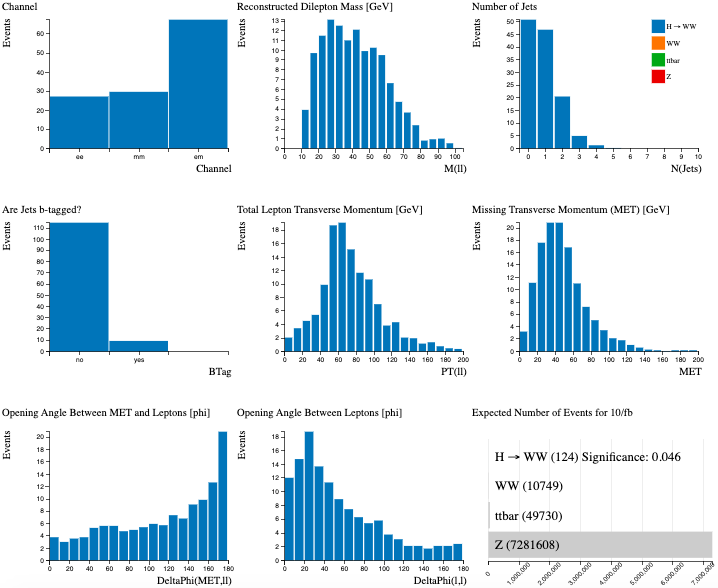
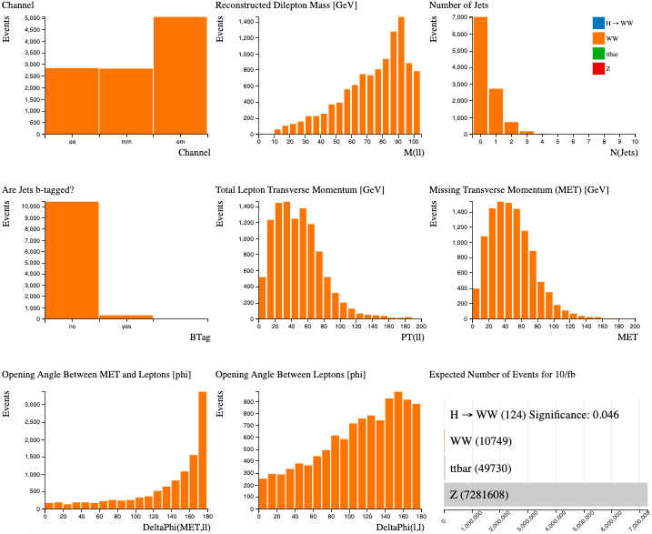
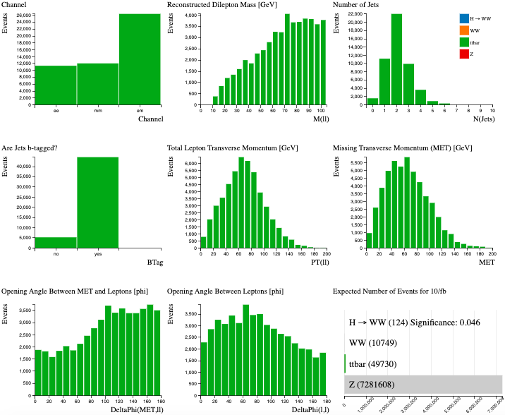
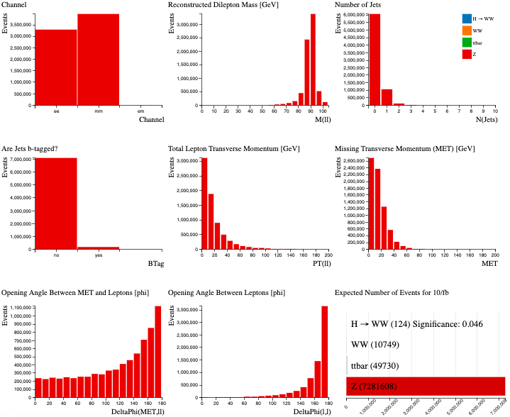

# Separate Signals

Let's look at the simulated data.  
Using the Histogram Analyser we can look at each sample separately and understand a little more about their characteristics.  
This will help us separate our signal from the background later.

**Select the sample by clicking on the bar in the Expected Number of Events histogram.**  
The rest of the histograms now just display the characteristics of your chosen sample.

## \\(H\rightarrow W^+W^-\\)

\\(H\rightarrow W^+W^- \rightarrow \ell^+\ell^-\nu \bar\nu\\) 

( \\(\ell\\) = electron, muon)

## Curriculim Learning Objective: Particle decay balancing with charge

[see e.g. OCR A-level physics 6.4.2]

Why does the higgs boson decay into particles whose charges sum to zero?

## Curriculum Learning Objective: Classification of leptons

[see e.g. OCR A-level physics 6.4.2(d)]

Electron and muon channels are shown separately in the histograms.

Our signal is the  Higgs boson which decays into two \\(W\\) bosons which subsequently decay into leptons and neutrinos.

Let's look at the individual histograms:

* The analysis considers electron and muon decays of the Higgs boson, so the events occur in all three channels. 
* The reconstructed mass from the two leptons peaks at 25-45 GeV. 
* The majority of Higgs events contain 0 or 1 jet.
* Most events have no b-tagged jets. 
* The total lepton transverse momentum peaks around 60 GeV.   
* Missing transverse momentum is due to the neutrinos in the final state. 
* The opening angle between the missing transverse momentum and the leptons tends to be large.
* The opening angle of the leptons from Higgs decays tends to be small.

## \\(WW\\)

Two \\(W\\) bosons both decaying leptonically.

Let's look at the individual histograms:

* The analysis considers electron and muon decays of the \\(W\\) bosons, so the events occur in all three channels. 
* The reconstructed mass from the two leptons peaks at around 80 GeV.
* The majority of \\(WW\\) events contain 0 or 1 jet.
* Most events have no b-tagged jets. 
* The total lepton transverse momentum peaks around 20-40 GeV.  
* Missing transverse momentum is due to the neutrinos in the final state. 
* The opening angle between the missing transverse momentum and the leptons tends to be large.
* The opening angle of the leptons from Higgs decays tends to be large.  Note this is different to the distribution for Higgs events.

Overall, the distributions are not so different from those for \\(H\rightarrow W^+W^-\\), hence it is a difficult background process to remove.

Displaying both samples together shows why it is difficult to separate the \\(H\rightarrow W^+W^-\\) signal from the \\(WW\\) background.

## top quark pair production (\\(t \bar t\\))

The top quark is the heaviest subatomic particle ever observed, with a mass that is about as heavy as an entire atom of gold. Top quarks are also among the most fleeting of particles, with a lifetime of about a trillionth of a trillionth of a second.

Due to its high mass and short lifetime, the top quark provides a unique environment to study a bare quark.

Looking at the individual histograms:

* The events occur in all three channels. 
* The reconstructed mass from the two leptons peaks at around 80 GeV.
* The majority of \\(t\bar t\\) events contain at least 2 jets.
* Most events have b-tagged jets. 
* The total lepton transverse momentum peaks around 60-70 GeV.  
* Missing transverse momentum is larger than seen in \\(H\rightarrow W^+W^-\\) and \\(WW\\) events.
* The opening angle between the missing transverse momentum and the leptons is fairly evenly distributed over the whole \\(\phi\\) range.
* The opening angle of the leptons from top quark production is fairly evenly distributed over the whole \\(\phi\\) range, tending to slightly larger values.

Therefore demanding

* non b-tagged jets, 
* only 0 or 1 jet, 
* small opening angle between leptons and 
* small opening angle between MET and leptons 

will reduce the top quark contribution.

## \\(Z\\)

Looking at the individual histograms:

* The events occur in the di-electron and di-muon channels. 
* The reconstructed mass from the two leptons peaks at around 90 GeV.
* The majority of events do not contain jets.
* Most events do not have b-tagged jets. 
* The total lepton transverse momentum peaks around zero.  
* The opening angle between the missing transverse momentum and the leptons is fairly evenly distributed over the whole \\(\phi\\) range, tending to slightly larger values.
* The opening angle of the leptons tends to be large (back-to-back) 

The \\(Z\\) boson has a mass of 91 GeV, which is reconstructed from the mass of the two leptons.  Requiring Reconstructed Dilepton Mass to be less than 75 GeV removes over 90 % of the Z events. This is an important cut to remove this background from our Higgs boson signal.

# Navigation

Go to the [previous section]( "Histogram Analyser (simulation + data)"), the [next section]( "Find the Higgs") or jump back to the [summary page]( "Summary page").