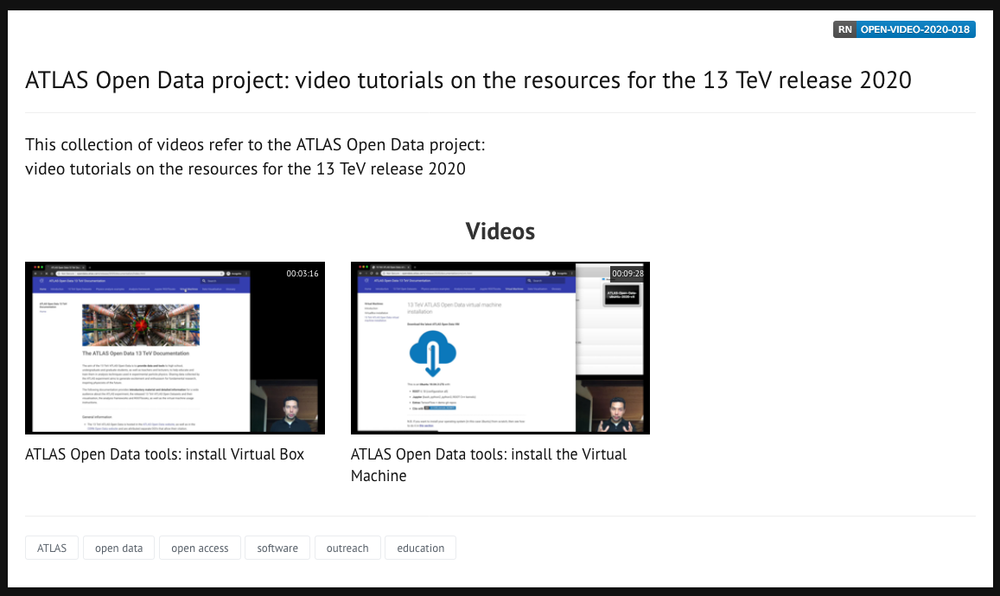
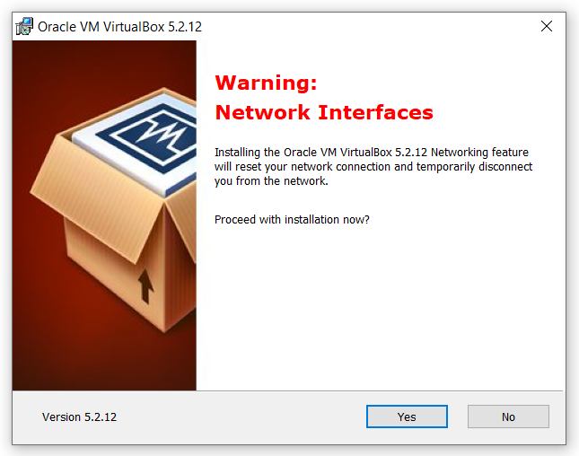
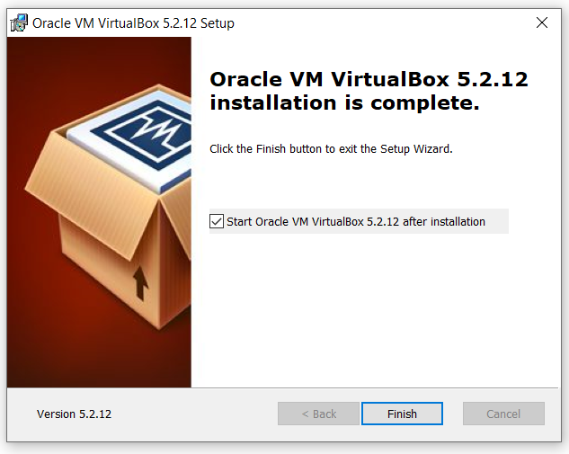
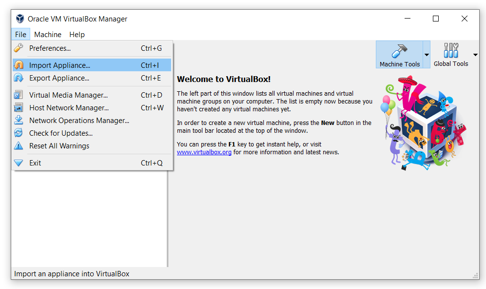
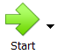
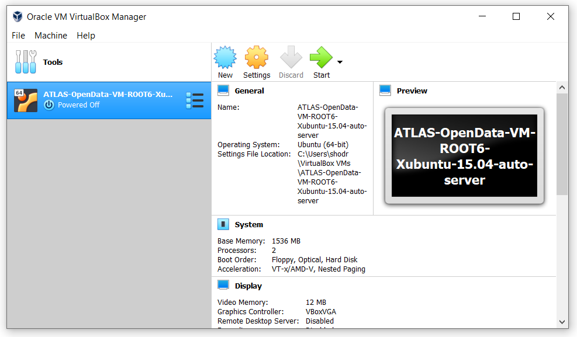

# 13 TeV ATLAS Open Data virtual machine

The 13 TeV ATLAS Open Data [virtual machine](https://en.wikipedia.org/wiki/Virtualization) (VM) allows you to create a virtual (rather than actual) operating system and test the 13 TeV ATLAS Open Data on your own host machine.

First, you will find below the instruction of how to install the Oracle VirtualBox, and after that the 13 TeV ATLAS Open Data virtual machine.

Follow the video tutorials in our CDS collection **[here](https://videos.cern.ch/record/2715261)**

# Oracle VirtualBox installation

The Oracle VirtualBox is the chosen software that supports Microsoft Windows, Linux, FreeBSD, Mac OS X, Solaris / OpenSolaris, ReactOS, DOS and other systems. Follow the instructions below to **install the VM** on your computer:

— Download VirtualBox you can free on the **[official website](https://www.virtualbox.org/)**.

**Check our ~3 min video tutorial to don't miss any detail**


<iframe scrolling="no"  src="https://videos.cern.ch/video/OPEN-VIDEO-2020-018-001" width="50%" height="1600" frameborder="0" allowfullscreen></iframe>


## Detailed instructions

— **What version to download?** Assumption of what your operating system. In this review we will explain how to install VirtualBox on Windows 10. Installing VirtualBox on all versions of Windows is identical. First download the installation file.

— After you downloaded the latest version of Virtual Box, proceed with the installation. Find the downloaded file in your computer (usually the downloaded file is in *С:\Users\User\Downloads\"filename"*), run the program and click "Next".

— After that, the component selection window will appear. Without changing anything, click "Next".

— In the next window, without any changing click "Next"

— Now a window will appear that says that the Internet will be temporarily disabled during the installation of the program. Click "Yes".

— And click "Install" to begin the installation.

— After the installation process is complete, click "Finish"

— Now you will see a clean window of your virtual machine without any operating systems:

* **Configure VirtualBox**

— If you have English installed on your system, the program will automatically change the interface language to English when you first start it. If this does not happen, go to the menu *“File” -> “Settings\or/Preferences”* and on the *Languages* tab select your *language*.

# 13 TeV ATLAS Open Data virtual machine installation

**Download the latest ATLAS Open Data VM**

This is an **Ubuntu 18.04.3 LTS** with:

* **ROOT** 6.18 (configuration all)

* **Jupyter** (bash, python2, python3, ROOT C++ kernels)

* **Extras** TensorFlow + demo git repos

* **Cite with** 

* The password of the VM is **root** (also to be `sudo`)

**Check our ~9 min video tutorial to don't miss any detail**


<iframe scrolling="no"  src="https://videos.cern.ch/video/OPEN-VIDEO-2020-018-002" width="50%" height="1600" frameborder="0" allowfullscreen></iframe>


## Detailed instructions

+ After you downloaded the VM file, start the VirtualBox. Go to the menu ***"File"*** **->** ***“Import Appliance...”*** (or perform the same function with the combination of buttons: **"Ctrl" + "I"**).

+ In the window, select the downloaded ".ova" file from the **Downloads** folder and click "Next":

+ Click "Import" without any changes:

+ The operating system should begin importing:

— Now your Virtual Machine with Ubuntu-Linux operating system is ready, start it by clicking  and use:

You may come across issues with hardware virtualisation. Some computers have virtualisation disable by default.

If you do, and due to the various manufacturers, the best is to Google something like:

**"how to enable virtualisation in [insert name and model of your computer]".**

*For example*, here is a solution for Lenovo.
Enable virtualisation:
 
1.       Boot systems to BIOS with the F1 key at power on.
2.       Select the Security tab in the BIOS.
3.       Enable Intel VTT or Intel VT-d if needed.
4.       Once enabled, save the changes with F10 and allow the system to reboot.

# Previous VM demo on how to run the VM

**Take a look to this video on how to get and run some notebooks and framework in your computer**


<CENTRE>
<iframe width="50%" height="1600" src="https://www.youtube.com/embed/Lj73Vjd6Nys?start=52" frameborder="0" allow="accelerometer; autoplay; encrypted-media; gyroscope; picture-in-picture" allowfullscreen></iframe>
</CENTRE>



_ _ _
**Information:** If you want to install your operating system (in this case Ubuntu) from scratch, then see how to do it in [**this section**]( "Introduction").
_ _ _

# Navigation
Go to the next [section]( "Histogram animation") or jump back to the [summary page]( "Summary page").