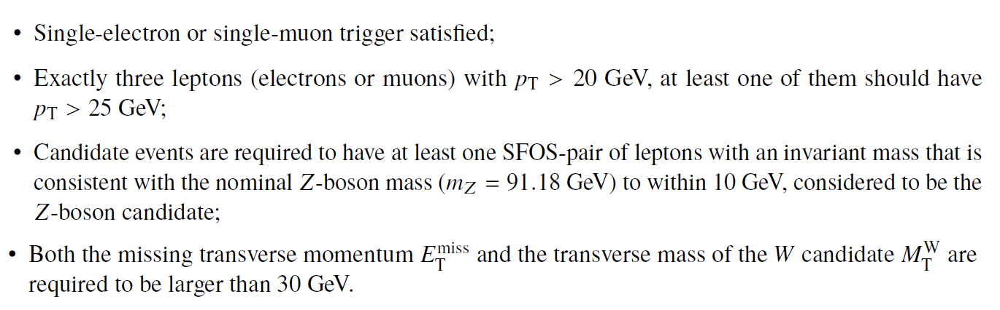

The study of the diboson production is an important part of the physics programme in hadron collisions as it represents an important test of the electroweak sector of the SM. In particular, the WZ diboson production arises from two vector bosons radiated by quarks or from the decay of a virtual W boson into a WZ pair, the latter of which involves a triple gauge coupling.

In order to identify these events, one needs to apply the standard object-selection criteria (defined in "Reconstructed physics objects") with a loose lepton pT requirement and tight lepton identification criteria, and an event-selection criteria defined as:





At the end, one is able to compare data and MC prediction for the distribution of e.g. the invariant mass of the reconstructed Z-boson candidate, as seen below.





# Navigation
Go to the [previous example]( "Supersymmetric particles with two leptons in the final state 13 TeV"), the [next example]( "ZZ Diboson Production 13 TeV") or jump back to the [summary page for the analysis examples]( "Summary page") or the [general summary page]( "Summary page").
