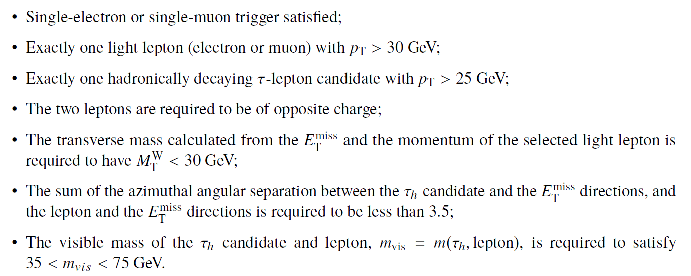
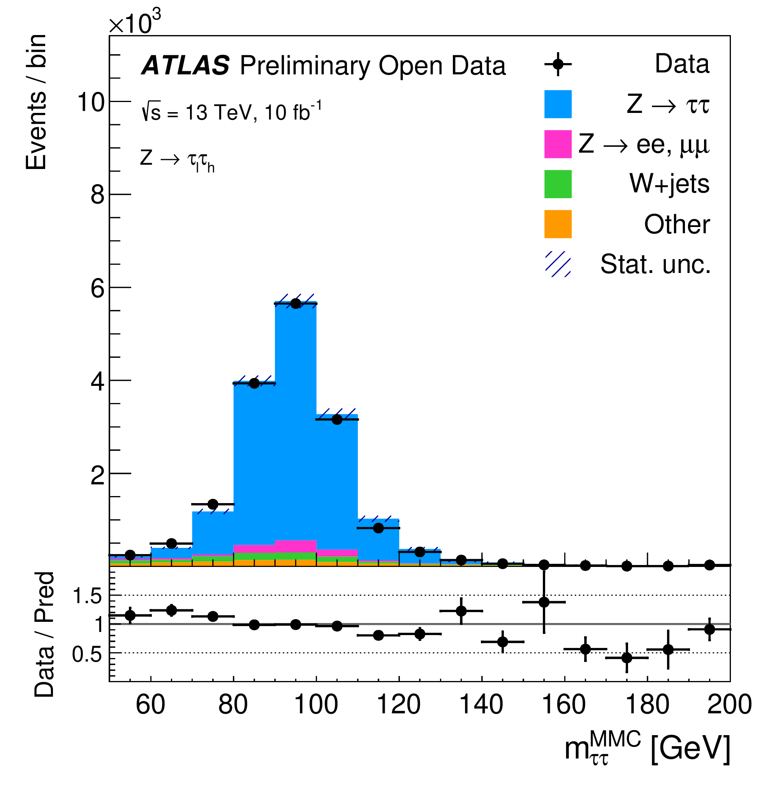

The τ-leptons play an important role in the physics programme of the LHC. They serve not only as a foundation to identify and precisely measure several SM production processes such as W → τν and Z → ττ, which represent the main irreducible backgrounds in measurements of the Higgs boson in H → ττ final states, but also are widely used in searches for new physics beyond the SM.

In the following, a selection criteria is made in order to reconstruct the Z → ττ decays from a hadronically decaying τ-lepton, accompanied by a tau-lepton that decays leptonically. The leptonic tau-lepton decays are reconstructed as electrons and muons in the final state. The hadronic tau-lepton decays produce a highly collimated jet in the detector consisting of an odd number of charged hadrons and possibly additional calorimetric energy deposits from neutral decay products.

In order to identify these events, one needs to apply the standard object-selection criteria (defined in "Reconstructed physics objects") with a stricter lepton pT and lepton calorimeter and tracking isolation (< 0.1) requirements and tight lepton identification criteria, and an event-selection criteria defined as:





At the end, one is able to compare data and MC prediction for the distribution of e.g. the reconstructed di-tau invariant mass, as seen below.





# Navigation
Go to the [previous example]( "Higgs to ZZ with 4 lep in the final state 13 TeV"), the [next example]( "BSM Z' to ttbar 13 TeV") or jump back to the [summary page for the analysis examples]( "Summary page") or the [general summary page]( "Summary page").