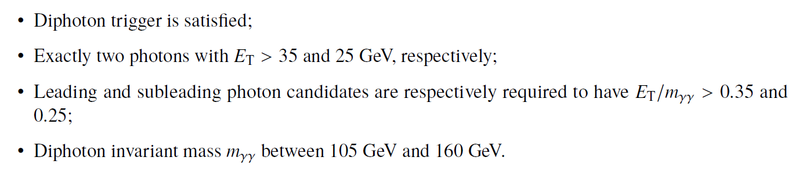

The H → yy decay mode provides a very clear and distinctive signature of two isolated and highly energetic photons, and is one of the main channels studied at the LHC. Despite the small branching ratio, a reasonably large signal yield can be obtained thanks to the high photon reconstruction and identification efficiency at the ATLAS experiment. Furthermore, due to the excellent photon energy resolution of the ATLAS calorimeter, the signal manifests itself as a narrow peak in the diphoton invariant mass spectrum on top of a smoothly falling irreducible background from QCD production of two photons.

In order to identify these events, one needs to apply the standard object-selection criteria (defined in "Reconstructed physics objects"), and an event-selection criteria defined as:





At the end, one is able to compare data and MC prediction for the distribution of e.g. the diphoton invariant-mass spectrum, as seen below. An excess of events in the distribution of the four-lepton invariant mass near 125 GeV is observed, which corresponds to the expected in the SM production of the Higgs boson.





# Navigation
Go to the [previous example]( "BSM Z' to ttbar 13 TeV") or jump back to the [summary page]( "Summary page").

