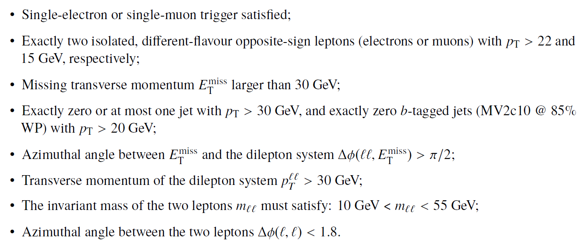
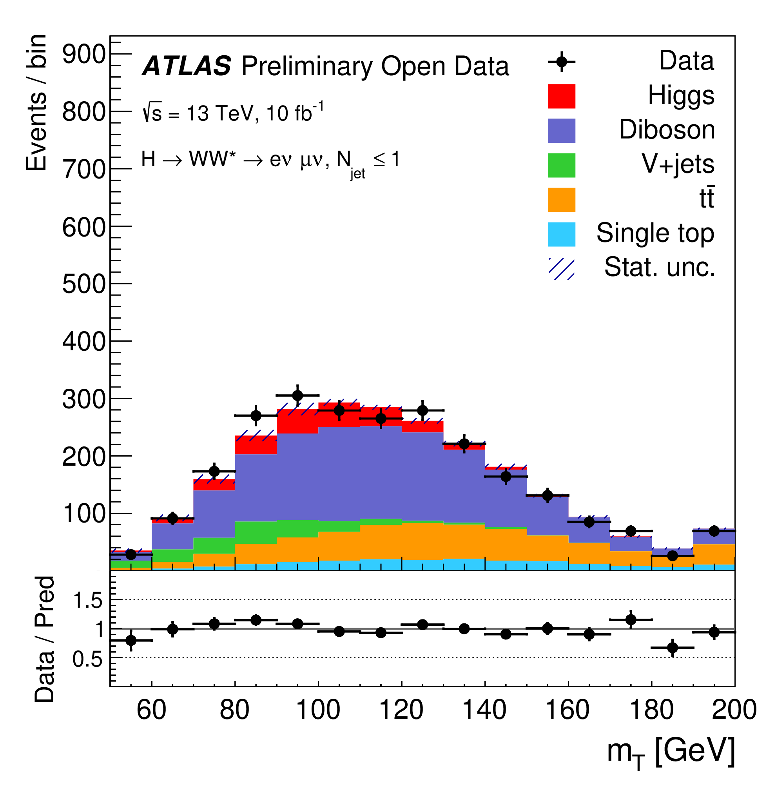

As described in the "Brief introduction to the Higgs Boson", the H → WW decay branching ratio for the Higgs boson with a mass of 125 GeV is predicted to be 0.214 in the SM, and corresponds to the second-largest branching fraction after the dominant H → bb decay mode. The predicted Higgs-boson production cross sections via the dominant gluon–gluon fusion (ggF) and vector-boson fusion (VBF) times H → WW branching fraction are 10.4 pb and 0.81 pb for ggF and VBF, respectively. Reducing the numerous backgrounds contributing to this channel and accurately estimating the remainder is a major challenge in this analysis. The dominant background stems from non-resonant WW diboson production, while tt, single-top-quark and W+jets (with the jet misidentified as a lepton) events, as well as non-resonant WZ and ZZ processes contribute to the overall background.

In order to identify these events, one needs to apply the standard object-selection criteria (defined in "Reconstructed physics objects") with a stricter lepton calorimeter and tracking isolation (< 0.1) requirements and tight lepton identification criteria, and an event-selection criteria defined as:





At the end, one is able to compare data and MC prediction for the distribution of e.g. the dilepton transverse mass, as seen below. A small excess in data is observed, and which corresponds to the production of the SM Higgs boson.





# Navigation
Go to the [previous example]( "Z boson production with two leptons in the final state"), the [next example]( "Supersymmetric particles with two leptons in the final state 13 TeV") or jump back to the [summary page]( "Summary page").