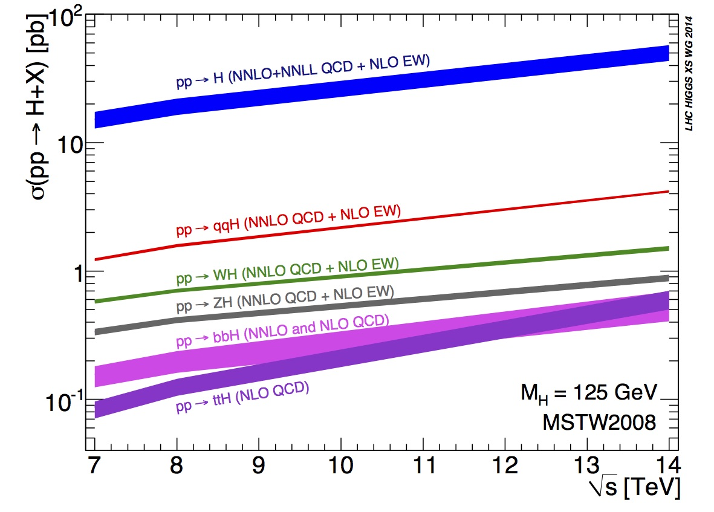
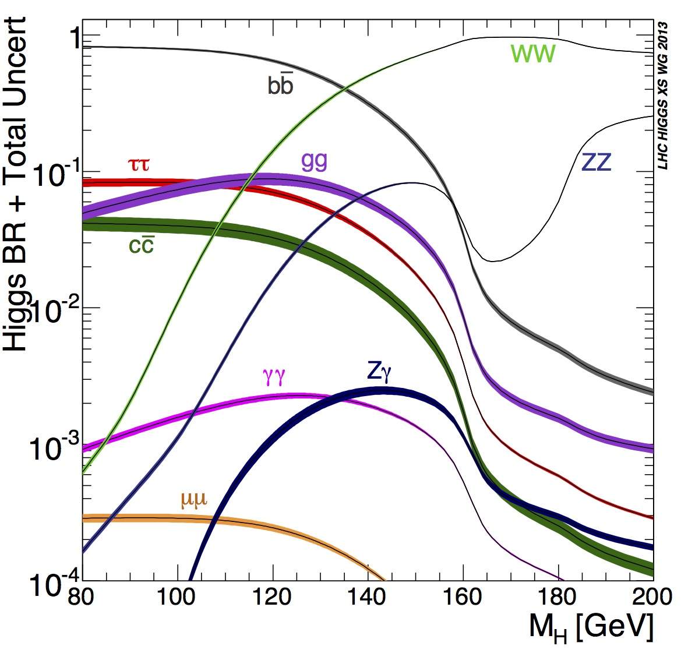

The general aim of the 13 TeV ATLAS Open Data and tools released is to provide a straightforward interface to replicate the procedures used by high-energy-physics researchers and enable users to experience the analysis of particle physics data in educational environments. Therefore, it is of significant interest to check the correct modelling of several SM process by the 13 TeV ATLAS Open Data MC simulation.

Hence, **twelve examples of physics analysis** (as reported in official release document [ATL-OREACH-PUB-2020-001](https://cds.cern.ch/record/2707171)) using the 13 TeV ATLAS Open Data inspired by and following as closely as possible the procedures and selections taken in already published ATLAS Collaboration physics results are introduced:

- **four high statistics** analyses with a selection of:
    - W-boson leptonic-decay events,
    - single-Z-boson events, where the Z boson decays into an electron–positron or muon–antimuon pair,
    - single-Z-boson events, where the Z boson decays into a tau-lepton pair with a hadronically decaying tau-lepton accompanied by a tau-lepton that decays leptonically,
    - top-quark pairs in the single-lepton final state. Each of these analyses have sufficiently high event yields to study the SM processes in detail, and are intended to show the general good agreement between the released 13 TeV data and MC prediction. They also enable the study of SM observables, such as the mass of the W and Z bosons, and that of the top quark.

- **three low statistics** analyses with a selection of single top-quarks produced in the single-lepton t-channel, diboson WZ events produced in the tri-lepton final state and diboson ZZ events produced in the fully-leptonic final states. These analyses illustrate the statistical limitations of the released dataset given the low production cross-section of the rare processes, where the variations between data and MC prediction are attributed to sizeable statistical fluctuations.

- **three SM Higgs boson** analyses with a selection of events in the $H \rightarrow WW$, $H \rightarrow ZZ$ and $H \rightarrow \gamma \gamma$ decay channels, which serve as examples to implement simplified analyses in different final-state scenarios and "re-discover" the production of the SM Higgs boson.

- **two BSM physics** analyses searching for new hypothetical particles: one implementing the selection criteria of a search for direct production of superpartners of SM leptons, and the second one implementing the selection criteria of a search for new heavy particles that decay into top-quark pairs, provided to implement a simplified analysis for searching for new physics using different physics objects.

# Brief introduction to the Higgs Boson

The [Standard Model](https://atlas.cern/Discover/Physics) of particle physics is a theory that describes the known matter in terms of its elementary constituents and their interactions. It is a widely proven and very successful theory in modern physics.

The Standard Model (SM) of particle physics postulates the existence of a complex scalar doublet with a vacuum expectation value, which spontaneously breaks the electroweak symmetry, gives masses to all the massive elementary particles in the theory, and gives rise to a physical scalar known as the [Higgs boson](https://home.cern/topics/higgs-boson). The Higgs boson is a fundamental particle, first observed by ATLAS and CMS in 2012, although theorised in the 1960s. The Higgs boson is the carrier particle for the Higgs field, a field present throughout our universe, which gives particles their mass. The more a particle interacts with the Higgs field, the higher its mass.

An illustration of the "Mexican hat" shape of the Higgs field potential is presented below: 





## Higgs boson production

Standard Model production of the Higgs boson at the LHC is dominated by the gluon fusion process (ggF), followed by the vector-boson fusion process (VBF). Associated production also have sizeable contributions, with a W or Z boson (VH) or a pair of top quarks (qqH).

The representative Feynman diagrams for the production processes are shown below: 





The figure below shows the Standard Model Higgs boson production cross sections as a function of the centre-of-mass energy. If the cross-section value (left axis) is multiplied by the luminosity of the dataset to be analysed, that is effectively how many Higgs bosons are expected to be produced (for different LHC energies).





Quantum chromodynamics *QCD* and Electroweak *EW* models are used to predict the production cross sections. Next-to-leading order *NLO* and next-to-next-to leading order *NNLO* calculations are carried. High order corrections are required to achieve the desired precision for these predictions.

Currently, the SM Higgs boson mass has been measured to be $125.09 \pm 0.24$ [GeV](https://en.wikipedia.org/wiki/Electronvolt) by combining ATLAS and CMS [measurements](https://arxiv.org/abs/1503.07589).

## Higgs boson decay

According to the Standard Model *SM*, the Higgs boson can decay into pairs of fermions or bosons. The Higgs boson mass is not predicted by the SM, but once measured the production cross sections and branching ratios can be precisely calculated.

The Standard Model Higgs boson decay branching ratios and total width are shown in the figure below (see [Higgs boson Physics PDG](https://pdg.lbl.gov/2013/reviews/rpp2013-rev-higgs-boson.pdf)):





You can see that the decay modes change depending on the mass of the Higgs boson. The figure represents how likely the Higgs boson is going to decay into a certain particle, or group of particles, depending on its mass.

The following table displays the branching ratios and the relative uncertainty for a Standard Model Higgs boson with a mass of 125 GeV:





The decay mode with the highest branching ratio BR is the decay to [hadrons](https://en.wikipedia.org/wiki/Hadron), with around 70\%, which is not easy to detect due to [multijet QCD](https://cds.cern.ch/record/1951336) backgrounds. A large fraction of the [leptonic](https://en.wikipedia.org/wiki/Lepton) decays are to a pair of [neutrinos](https://en.wikipedia.org/wiki/Neutrino), with around 20\%, which are difficult to detect since the neutrinos hardly interact with matter. The decay to pairs of electrons, muons and tau-leptons have a BR of about 10\% of the total. In fact, the tau [life time](https://en.wikipedia.org/wiki/Particle_decay) is very short, 3x10-13s, so it can be reconstructed only from its decay products. The efficiency of reconstructing tau-leptons is much lower than that of electrons and muons. 

- [Example of physics analysis: the case of SM W-boson production in the single-lepton final state]( "Example of physics analysis: the case of SM W-boson production in the single-lepton final state")

- [Example of physics analysis: the case of t-channel single-top-quark production in the single-lepton final state]( "Example of physics analysis: the case of t-channel single-top-quark production in the single-lepton final state")

- [Example of physics analysis: the case of the top-quark pair production in the single-lepton final state]( "Example of physics analysis: the case of the top-quark pair production in the single-lepton final state")

- [Example of physics analysis: the case of the SM Z-boson production in the two-lepton final state]( "Example of physics analysis: the case of the SM Z-boson production in the two-lepton final state")

- [Example of physics analysis: the case of the SM Higgs boson production in the H $ \rightarrow $ WW decay channel in the two-lepton final state]( "Example of physics analysis: the case of the SM Higgs boson production in the H $ \rightarrow $ WW decay channel in the two-lepton final state")

- [Example of physics analysis: the case of a search for supersymmetric particles in the two-lepton final state]( "Example of physics analysis: the case of a search for supersymmetric particles in the two-lepton final state")

- [Example of physics analysis: the case of SM WZ diboson production in the three-lepton final state]( "Example of physics analysis: the case of SM WZ diboson production in the three-lepton final state")