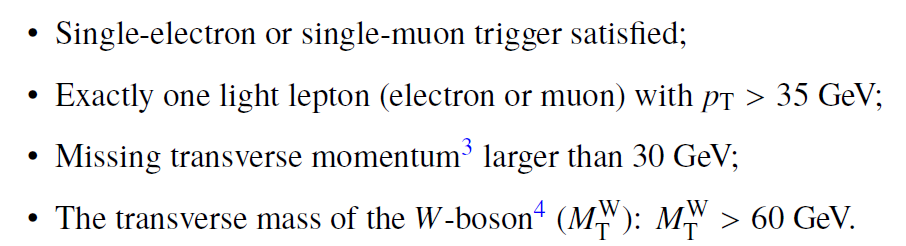
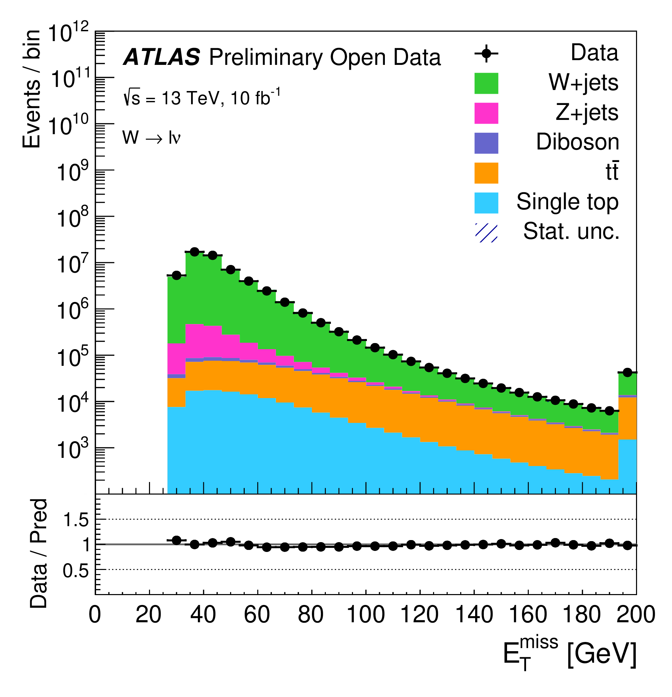

W-bosons are produced abundantly at the LHC and the measurements of the inclusive production cross section of the W bosons and of the asymmetry between the positively-charged and negatively-charged W-boson cross sections constitute important tests of the SM. In addition, W+jets processes are a significant background to studies of SM processes such as single-top production, top-quark pair production, as well as searches for the SM Higgs boson and for BSM physics.

In order to identify these events, one needs to apply the standard object-selection criteria (defined in "Reconstructed physics objects"), with a stricter lepton pT (> 35 GeV) and lepton calorimeter and tracking isolation (< 0.1) requirements and tight lepton identification criteria, and an event-selection criteria defined as:





At the end, one is able to compare data and MC prediction for the distribution of e.g. the missing transverse momentum, as seen below:





# Navigation
Go to the [next example]( "Single top quark production 13 TeV") or jump back to the [summary page]( "Summary page").