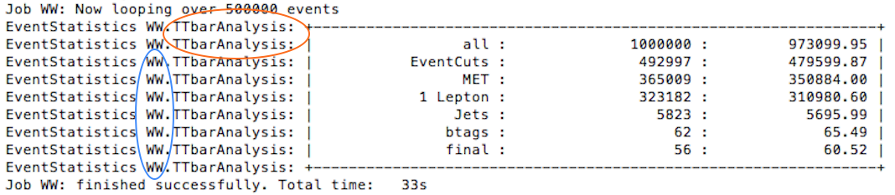
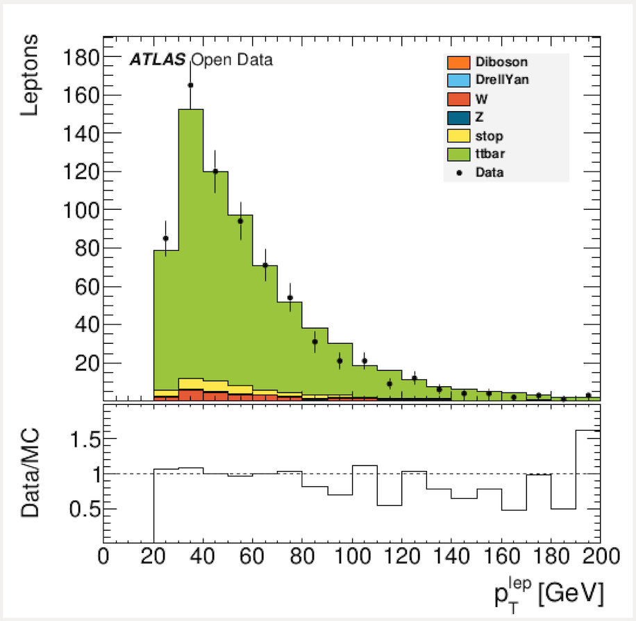

# Take a closer look

The first thing to say is that **you cannot break it !**

Change the code, do whatever you like.

You have a local copy.  If for some reason it all goes horribly wrong, just delete what you have and start again.

No-one will know.  No-one will care.

It is much better to work out things for yourself.  Go on, make a change to the code and see if it does what you intend.

## Configuration files

The Configurations folder contains the configuration files.  The configuration files contain information about what analysis should run and how the results should be plotted.

### **Step 1: Run an Analysis**

Now let's take a closer look at what is going on when you run the analysis.


```
python RunScript.py -a TTbarAnalysis

```


The Configuration.py file specifies how an analysis should behave.  You can look at the code directly here: [Configuration.py](https://github.com/atlas-outreach-data-tools/atlas-outreach-data-tools-framework/blob/master/Configurations/Configuration.py)

The preconfigured analysis is a top pair analysis called TTbarAnalaysis.  This can be changed later if you wish to look at another analysis, or just use the -a option such as 


```
python RunScript -a WAnalysis

```


The first portion of the configuration file defines the **Job** and looks like this:

```
Job = {
     "Batch"           : True,              (switches progress bar on and off, forced to be off when running in parallel mode)
     "Analysis"        : "TTbarAnalysis",   (names the default analysis to be executed)
     "Fraction"        : 1,                 (determines the fraction of events per file to be analysed)
     "MaxEvents"       : 1234567890,        (determines the maximum number of events per file to be analysed)
     "OutputDirectory" : "results/"         (specifies the directory where the output root files should be saved)
 }
```

The default analysis is TTbarAnalysis, so if an analysis is not defined with the -a option, TTbarAnalysis will run.

By default, the analysis will run over all events in a file.  If you want to run just half the events, then change the fraction to 0.5

The results of running RunScript.py will be written to the OutputDirectory, which is set to be called results.

The second portion of the configuration file specifies which **Processes** to include. The locations of the individual files that are to be used for the different processes are defined:

```
Processes = {
    # Diboson processes
    "WW"                    : "Input/MC/mc_105985.WW.root",  (single file)
    ...
    "data_Egamma"           : "Input/Data/DataEgamma*.root", (potentially many files)
}
```

Whilst the analysis is running you will see the analysis name \\( circled in orange below \\)  and the process you are running over \\( circled in blue below \\) .



The names chosen for the processes are important as they are the keys used in the infofile.py to determine the necessary scaling factors for correct plotting.

### **Step 2: Plot the results**

Now let's take a closer look at what is going on when you plot the results of your analysis.

```
python PlotResults.py Configurations/PlotConf_TTbarAnalysis.py
```

The plotting configuration file allows you to steer the plotting process. Each analysis has its own plotting configuration file to accommodate changes in background composition or histograms required.

Look at the code directly here: [PlotConf\_TTbarAnalysis.py](https://github.com/atlas-outreach-data-tools/atlas-outreach-data-tools-framework/blob/master/Configurations/PlotConf_TTbarAnalysis.py)

General information for plotting include the **Luminosity** and **InputDirectory** located at the top of the file:

```
config = {
      "Luminosity"     : 1000,
      "InputDirectory" : "results",
      ...
```

If you remember, the output directory of step 1 was results.  So the input directory for step 2 must have the same name.

The names of the histograms to be drawn can be specified like so:

```
"Histograms" : {
      "WtMass"          : {},
      "etmiss"          : {rebin : 4, log_y : True},
      "lep_phi"         : {"y_margin" : 0.6},
      ...
```

Note that it is possible to supply additional information via a dictionary-like structure to further detail the histogram options. Currently available options are:

* **rebin: integer      **used to merge X bins into one.  Useful in low statistics situation.
* **log\_y : bool**          if True is set as the bool the main depiction will be drawn in logarithmic scale.
* **y\_margin : float**   sets the fraction of whitespace above the largest contribution in the plot. Default value is 0.1

## Definition of Depictions and Paintables.

A **depiction** is a way of visualising information. Available depictions include simple plots, ratios and agreement plots.

Each plot consists of several depictions of paintables.  
A **paintable** is a histogram or stack plot, with added information such as colours and which physics processes to be included.

A simple definition of paintables may look like this:

```
'Paintables': {
    "Stack": {
        "Order"     : ["Diboson", "DrellYan", "W", "Z", "stop", "ttbar"],
        "Processes" : {
            "Diboson" : {
                "Color"         : "#fa7921",
                "Contributions" : ["WW", "WZ", "ZZ"]},

            "DrellYan": {
                "Color"         : "#5bc0eb",
                "Contributions" : ["DYeeM08to15", "DYeeM15to40", "DYmumuM08to15", "DYmumuM15to40", "DYtautauM08to15", "DYtautauM15to40"]},
            ...
    },

    'Higgs': {
        'Color': '#0000ff',
        'Contributions': ['ggH125_WW2lep']},

    "data" : {
        "Contributions": ["data_Egamma", "data_Muons"]}
```

**Stack** and **data** are specialised names for paintables. This ensures that only one stack of simulated Monte Carlo data and one data representation are present in the final plot.

A **Stack** shows the different processes specified in **Order.  **The processes are stacked upon each other to give an idea of the composition of the simulated Monte Carlo data.  Notice that the processes specified in the code above (Diboson, DrellYan, W, Z, stop, ttbar) appear in the plot legend below.

The individual processes are defined under **Processes**. Each process has a certain colour (using hex color codes) and a list of **Contributions**. These contributing processes are defined in both [Configuration.py](https://github.com/atlas-outreach-data-tools/atlas-outreach-data-tools-framework/blob/master/Configurations/Configuration.py) and [infofile.py](https://github.com/atlas-outreach-data-tools/atlas-outreach-data-tools-framework/blob/master/Plotting/infofile.py).

**data **is a special paintable. Since the data does not need to be scaled there is no need for it to be defined in [infofile.py](https://github.com/atlas-outreach-data-tools/atlas-outreach-data-tools-framework/blob/master/Plotting/infofile.py). However, it still has to be included in [Configuration.py](https://github.com/atlas-outreach-data-tools/atlas-outreach-data-tools-framework/blob/master/Configurations/Configuration.py).

Other paintables not defined in the stack (e.g. **Higgs** in the above example) are considered as **overlays**. Overlays are used to show possible signals or to compare shapes between multiple overlays (see also [PlotConf\_ZPrimeAnalysis.py](https://github.com/atlas-outreach-data-tools/atlas-outreach-data-tools-framework/blob/master/Configurations/PlotConf_ZPrimeAnalysis.py) for the ZPrime Analysis).

There are currently three types of depictions available:

* **Main**: simply show the paintables in a simple plot fashion.
* **Agreement**: typically used to evaluate the agreement between two paintables (usually the stack of simulated data and the real data).
* **Ratio**: show the ratio of the first paintable w.r.t. the second paintable (e.g. **Data/MC** to show how well the simulated data and real data agree).  

The order of the depictions is determined in line 2 of the code example above.



Here we can see an agreement plot above and ratio plot below for lepton \\( p_T \\) .

# Navigation
Go to the next [section]( "Plots explained") or jump back to the [summary page]( "Summary page").