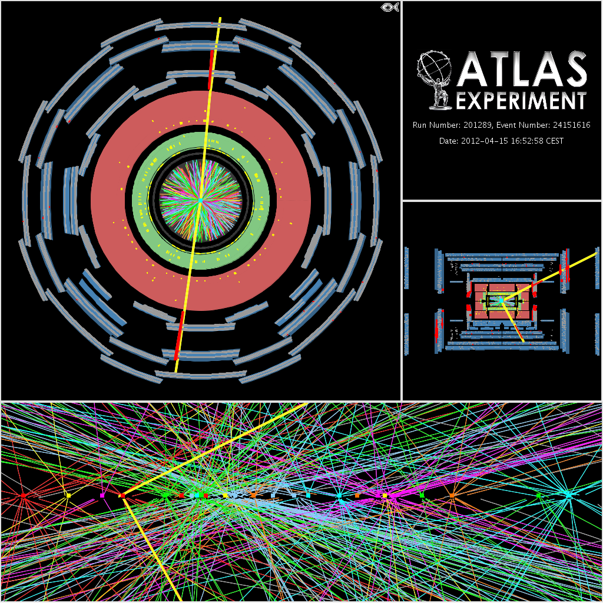

# Data and simulated data





## Data 
The ATLAS collaboration has released 1 inverse femtobarn of data.
The **ATLAS Open Data datasets** are available on this website and on the CERN Open Data portal.

One [inverse femtobarn](http://writing-guidelines.web.cern.ch/entries/inverse-femtobarn) corresponds to approximately 100 trillion proton-proton collisions.

## Simulated data
Simulated data, commonly named Monte Carlo (MC), are a key feature for the LHC
experiments. 
These events are simulated using current theoretical models and are used to compare theory with real data.

The full simulation requires the following steps
* **Event generation**: Hadronic final states using the
proton-proton collisions are generated using programs relying  on  theoretical  calculations,  phenomenological
models and experimental inputs.

* **Detector Simulation**: Interaction of the generated
particles inside the ATLAS detector is simulated.

* **Digitisation**: The detector response is derived from
the particle interactions and it is written in a format
compatible with the real output of the detector. In addition,
because of the high rate of collisions in the LHC, digitised
signals from several simulated events can be piled-up to
create samples with a realistic experimental background.

* **Reconstruction**:  Particle trajectories and energies
from the detector are reconstructed. Such final samples
are used by the physicists.

## Comparing real data and simulated data

Real data and simulated data do not always agree.  This can be due to various reasons, such as

* the conditions not being exactly the same e.g. Energy, pile-up.

* not all background processes are included in the simulated data, 

* the physics has not been exactly modeled by the theory.

If the data and simulated data does not agree, it is important that physicists understand why.