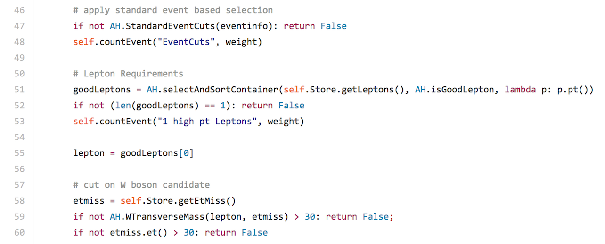
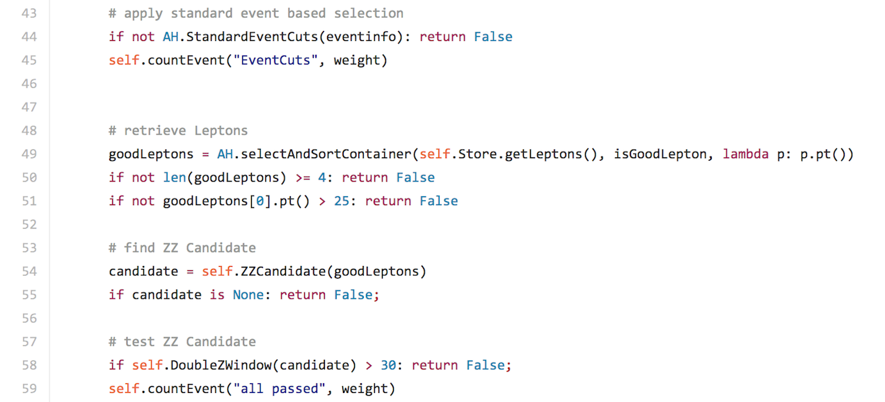

# Event selection

The events in the dataset ntuples have been selected according to a selection criteria.  The variables are defined in [variable names](https://cheatham1.gitbooks.io/openatlasdatatools/content/variable_names.html).

The standard event based selection criteria are:

* A single electron or muon trigger has fired;
* The primary vertex has at least 5 tracks;
* There is at least one good lepton with \(p_T\) > 25 GeV;
* Leptons are required to be isolated
( Both ptcone30 and etcone20 < 0.15);  
* The event passes the Good Run List (GRL);
* A veto exists on events containing bad jets.

The standard event based selection code is 

Look at the code directly here: 
[AnalysisHelpers.py](https://github.com/atlas-outreach-data-tools/atlas-outreach-data-tools-framework/blob/master/Analysis/AnalysisHelpers.py)

Analysis specific requirements are detailed below.

## \(W\) Analysis

This analysis searches for \(W\) bosons decaying to leptons. 

The analysis specific event selection criteria are:

* Exactly one good lepton with \(p_T\) > 25 GeV; 
* Missing ET > 30 GeV;
* Reconstructed transverse mass \(W\) > 30 GeV.

The analysis code is located in the Analysis folder. It is used to write out histograms for the individual input files which will be used for plotting purposes later.
Here is a snippet from the \(W\) analysis code called  WAnalysis.py:

Look at the code directly here: [WAnalysis.py](https://github.com/atlas-outreach-data-tools/atlas-outreach-data-tools-framework/blob/master/Analysis/WAnalysis.py)
## \(Z\) Analysis

This analysis seaches for \(Z\) bosons decaying into a lepton pair. 

The analysis specific event selection criteria are:

* Exactly two good leptons with \(p_T\) > 25 GeV; 
* Leptons have opposite charge;
* Leptons have same flavour; 
* |reconstructed mass lepton pair - PDG mass \(Z\)< 20 GeV.

Here is a snippet from the ZAnalysis code:

Look at the code directly here: [ZAnalysis.py](https://github.com/atlas-outreach-data-tools/atlas-outreach-data-tools-framework/blob/master/Analysis/Z
Analysis.py)

## Top pair Analysis

This analysis searches for a top quark and an antitop quark.

The analysis specific event selection criteria are:

* Exactly one good lepton with \(p_T\) > 25 GeV; 
* At least four good jets;
* At least two b-tagged jets (MV1@70%);
* Missing ET > 30 GeV;
* Reconstructed transverse mass \(W\) > 30 GeV.

Here is a snippet from the top pair Analysis code:

Look at the code directly here: [ttbarAnalysis.py](https://github.com/atlas-outreach-data-tools/atlas-outreach-data-tools-framework/blob/master/Analysis/ttbar
Analysis.py)

## \(WZ\) Analysis

This analysis looks for both a \(W\) boson candidate and \(Z\) boson candidate.

It is a relatively clean signature due to 3 leptons in the final state.  It is interesting for physics since it is a probe for triple gauge couplings.

The analysis specific event selection criteria are:

* Exactly three good leptons with \(p_T\) > 25 GeV;
* \(WZ\) candidate is chosen by finding the \(Z\) boson candidate closest to the nominal \(Z\) mass;
* Mass lepton pair minus mass \(Z\) < 10 GeV;
* Reconstructed transverse mass \(W\) > 30 GeV.

Here is a snippet from the \(WZ\) Analysis code:

Look at the code directly here: [WZAnalysis.py](https://github.com/atlas-outreach-data-tools/atlas-outreach-data-tools-framework/blob/master/Analysis/WZ
Analysis.py)

## \(ZZ\) Analysis

This analysis looks for two \(Z\) boson candidates where both \(Z\) bosons decay to leptons.  
Two Z candidates are built from leptons pairs of the same flavour and opposite charge, minimising the total deviation of both candidates from the Z boson mass.

The analysis specific event selection criteria are:

* Exactly four good lepton with \(p_T\) > 10 GeV;
* Leptons have opposite charge and same flavour; 
* |reconstructed mass \(Z\) candidate 1 - PDG mass \(Z\)| + |reconstructed mass \(Z\) candidate 2 - PDG mass \(Z\)| < 20 GeV.

Here is a snippet from the \(ZZ\) Analysis code:

Look at the code directly here: [ZZAnalysis.py](https://github.com/atlas-outreach-data-tools/atlas-outreach-data-tools-framework/blob/master/Analysis/ZZ
Analysis.py)

## \(H\rightarrow WW\) Analysis

This analysis searches for \(W\) bosons decaying to leptons, with no jets.

\(H\rightarrow W^+W^- \rightarrow ℓ^+ ℓ^-\nu  \bar \nu\) (\(ℓ\) = electron, muon)

The analysis specific event selection criteria are:

* Exactly two good leptons with \(p_T\) > 25 GeV;
* Leptons have opposite charge;
* No jets with \(p_T\) > 25 GeV;
* \(p_T\) lepton pair > 30 GeV;
* Angular separation between lepton pair and Missing ET > \(\pi\)/2;
* Reconstructed transverse mass \(W\) > 30 GeV;
* Mass lepton pair < 55 GeV;
* Angular separation between leptons < 1.8.
 
 
If leptons have same flavor:
* mass lepton pair > 12 GeV;
* |reconstructed mass lepton pair - PDG mass \(Z\)| > 15 GeV;
* Missing ET > 40 GeV;
 
Else:
* mass lepton pair > 10 GeV;
* Missing ET > 20 GeV;

Here is a snippet from the \(H\rightarrow WW\) Analysis code:

Look at the code directly here: [HWWAnalysis.py](https://github.com/atlas-outreach-data-tools/atlas-outreach-data-tools-framework/blob/master/Analysis/HWW
Analysis.py)

## \(Z'\) Analysis

This analysis searches for \(Z'\) in the semileptonic top pair channel.

The analysis specific event selection criteria are:

* Exactly one good lepton with \(p_T\) > 25 GeV;
* At least four good jets;
* At least one b-tagged jet (MV1@70%); 
* Missing ET > 30 GeV;
* Reconstructed transverse mass \(W\) + Missing ET > 60 GeV.

Here is a snippet from the \(Z'\)code:

Look at the code directly here: [ZPrimeAnalysis.py](https://github.com/atlas-outreach-data-tools/atlas-outreach-data-tools-framework/blob/master/Analysis/ZPrime
Analysis.py)