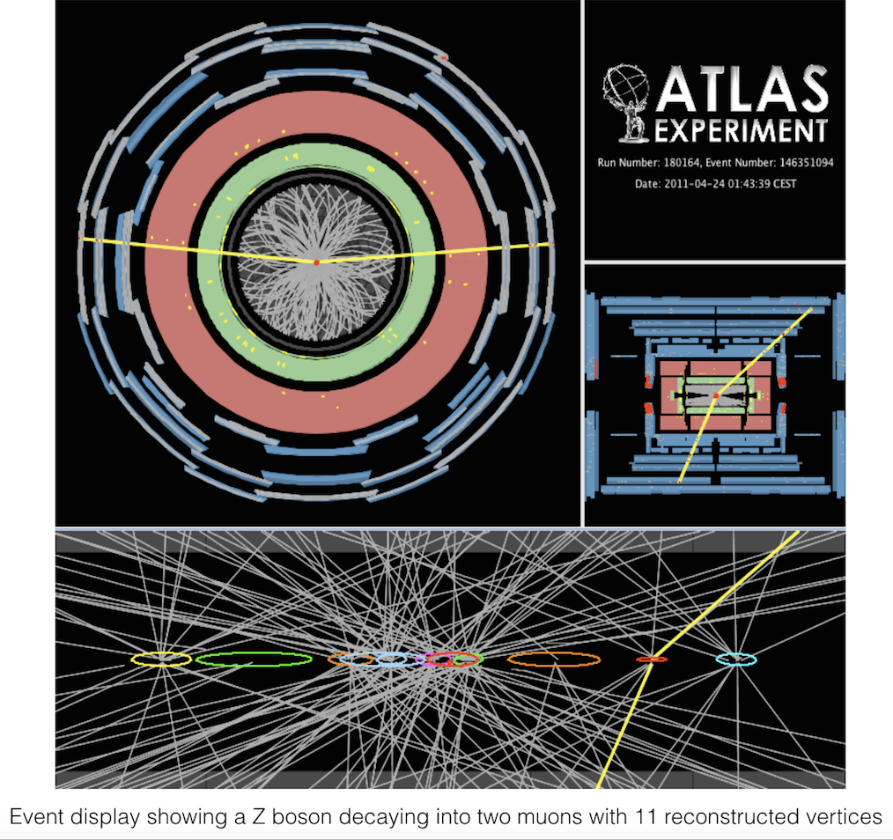

# ATLAS events





Beams of [protons](https://en.wikipedia.org/wiki/Proton) are accelerated around the [Large Hadron Collider (LHC)](http://home.cern/topics/large-hadron-collider) and are brought to collide at the centre of the [ATLAS](http://home.cern/about/experiments/atlas) detector. The collisions produce debris in the form of new particles which fly out in all directions. Over a billion particle interactions take place in the ATLAS detector every second.

The protons within the two beams are grouped in bunches which are squeezed down in size to increase the chances of a collision.  In the released data, the bunches crossed every 50 ns.  There were about 30 collisions on average per **bunch-crossing**.  

An **event** is the data resulting from a particular bunch-crossing. 

**Pile-up** is defined as the average number of particle interactions per bunch-crossing.  There are different types of pile-up.  

**In-time pile-up** is additional proton-proton collisions occuring in the same bunch-crossing as the collision of interest.

**Out-of-time pile-up** is additional proton-proton collisions occuring in bunch-crossings just before and after the collision of interest. When detectors are sensitive to several bunch-crossings or their electronics integrate over more than 25 ns, these collisions can affect the signal in the collision of interest.

[Luminosity](http://home.cern/topics/high-luminosity-lhc) is one of the most important parameters of the LHC.
The higher the luminosity, the more data the experiments can gather to allow them to observe rare processes.
However, increasing luminosity increases pile-up which presents a challenge for physics analyses to successfully identify collisions of interest resulting from signal processes.

The **primary vertex** stems from the high transverse momentum inelastic collision of two protons. In a typical collision event, several primary vertices along the beam are produced.  It is important to correctly identify them from the many low transverse momentum proton-proton interactions, so called minimum bias events.

The **event display** at the top of this page shows a candidate \(Z\) boson decaying into two muons with 11 reconstructed vertices. This event was recorded on April 24th and is typical for the 2011 environment with high pile-up.

The reconstruction of primary vertices is important for many physics studies, including searches for new particles, identifying jets containing \(b\)-quarks or taus and reconstruction of exclusive \(b\)-quark decays.