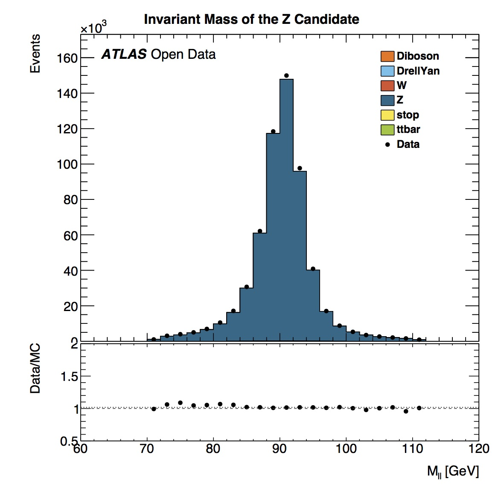
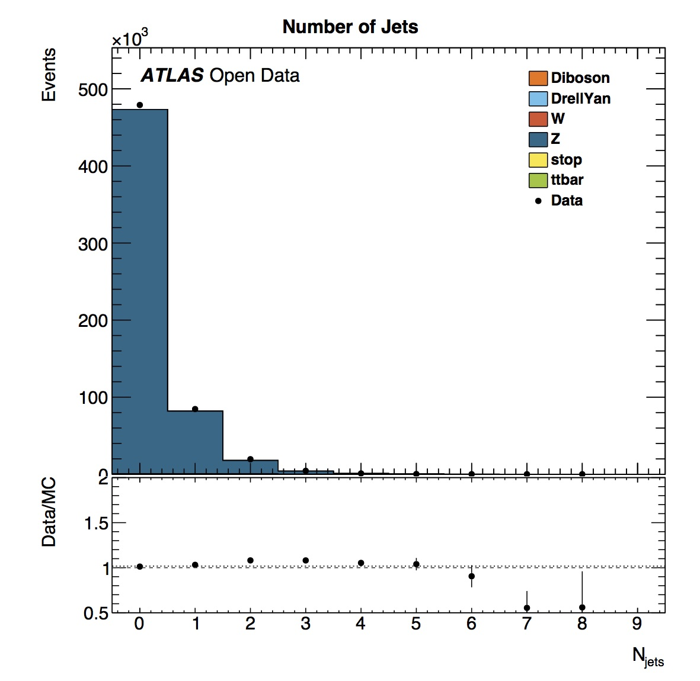
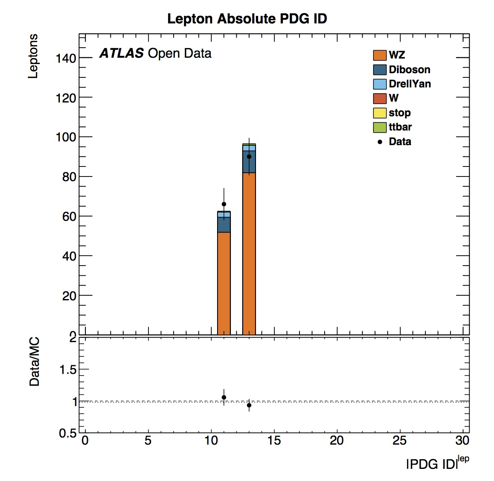

# More plots

## $$Z$$ Analysis




The transverse mass of the $$Z$$ candidate shows a peak in the distribution in the 90-95 GeV bin.  The average $$Z$$ mass based on [published results](http://pdg.lbl.gov/2012/listings/rpp2012-list-z-boson.pdf) is 91.1876 +/- 0.0021 GeV.  The real and simulated data distributions are in good agreement.

If we add up the number of events in this distribution we see we have about 500 $$Z$$ candidates. 








Data and simulated data are in good agreement for the number and mass of jets reconstructed.

## $$WZ$$ Analysis








Here we can see the reconstructed mass of the $$W$$ and $$Z$$ bosons.
The transverse mass of the $$Z$$ candidate shows a peak in the distribution in the 88-92 GeV bin.  This is in good agreement with the [published value](http://pdg.lbl.gov/2012/listings/rpp2012-list-z-boson.pdf) of 91.1876 +/- 0.0021 GeV.

The transverse mass of the $$W$$ candidate shows a peak in the distribution in the 60-80 GeV bin.
This is in reasonable agreement with the [published value](http://pdg.lbl.gov/2012/listings/rpp2012-list-w-boson.pdf) of 80.385 +/- 0.015 GeV.

If we add up the number of events in these distributions we see we have only about 50 $$W$$ and 40 $$Z$$ candidates.  

The error bars have increased in size compared with the $$Z$$ analysis.  This analysis has lower statistics.  A larger dataset would increase the number of candidates and decrease the errors.  This highlights why physicists need to collect large quantities of data to make precision measurements.  











The lepton PDG ID distributions shows that we are looking at electrons and muons.  The energy and transverse momentum distributions in real data agree well with simulated data.

# Navigation
Go to the next [section]( "Create a new plot") or jump back to the [summary page]( "Summary page").