# Create a new plot

You can create some new plots, but you need to run over all the datasets.  

If you are running the small VM, you need to transfer the complete dataset you have downloaded into your input directory.
 
```
python DownloadScript.py -a 'unzip, replace'
```

This command unzips `complete_set_of_ATLAS_open_data_samples_July_2016.zip`  and replaces the data samples that are currently in your input directory.

Now you have all the data, it could take a long time to produce plots.  So we suggest you just run over a fraction of the data initially - so all the datasets, just a fraction of the events within each one.

This might sound abit crazy, you have just downloaded all the data, but then you only run over a fraction of it.  Well, you need to know what your new variable looks like in all the samples.  Just a fraction of the events will give you a good idea.  You do not have to run over all the data, just all the datasets. 

Modify the file `Configurations/Configuration.py` and change fraction from 1 to 0.1 

### Let's get plotting

One of the standard plots produced in an analysis is jet pseudorapidity, \(\eta_{\rm{jet}}\).  Let's use that to help us create a new plot that is not currently in the standard plots.


Look in the chapter Variable names.  You will see that jet\_eta is defined as a branch name in the data samples or tuples.  There is another branch name jet\_phi, which we have not yet plotted.  So let's plot that.

You can also launch root and take a look at a datafile, to see that the branch exists.

In the main directory, ATLAS-DataAndTools, look at the muon data file: 


```
root Input/Data/DataMuons.root
TBrowser m
```

Select the file and then you will see the branch names.  Scroll down to find the branch called jet_phi. 

 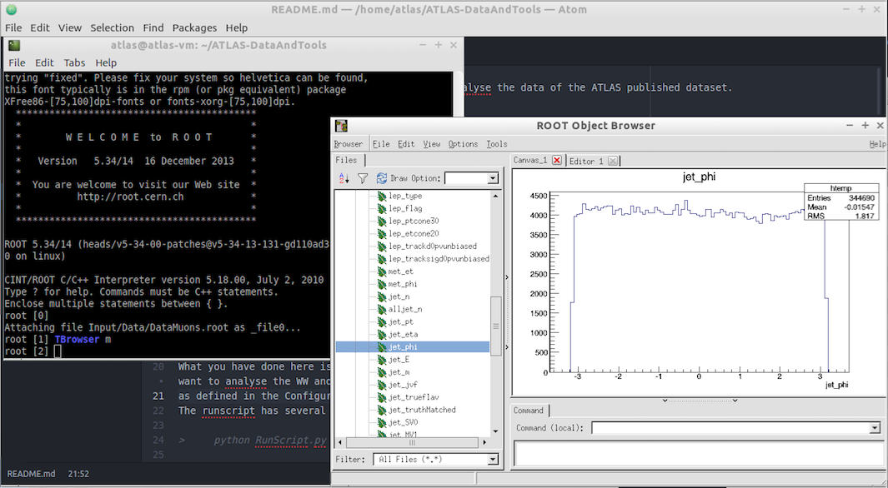 
 
 To quit root
 
 `.q`
 
 ## Modify TTbarAnalysis
 
 To create a new plot in the TTbarAnalysis we have to make changes to 3 files
 
 1. [Analysis/TTbarAnalysis.py](https://github.com/atlas-outreach-data-tools/atlas-outreach-data-tools-framework/blob/master/Analysis/TTbarAnalysis.py)
 
 2. [Analysis/StandardHistograms.py](https://github.com/atlas-outreach-data-tools/atlas-outreach-data-tools-framework/blob/master/Analysis/StandardHistograms.py)
 
 3. [Configurations/PlotConf\_TTbarAnalysis.py](https://github.com/atlas-outreach-data-tools/atlas-outreach-data-tools-framework/blob/master/Configurations/PlotConf_TTbarAnalysis.py) 
 
Then run the analysis again and plot the results using RunScript.py and PlotResults.py
 
See if you can work out to do yourself, without reading the instructions below.  Use what is done for jet_eta, but change it to jet_phi.
 
The editors available to you to make changes to files are different in the large and small VM, so there are separate instructions below. 
 
 # If you are using the large VM or have downloaded the software and all datsets
 
###  1. Analysis/TTbarAnalysis.py
 
 Using the vim editor
 
 `vim Analysis/TTbarAnalysis.py`
 
 Type 'i' to enter insert mode.
 Add a line initialising the histogram jet\_phi, copying what was done for jet_eta. 
 
 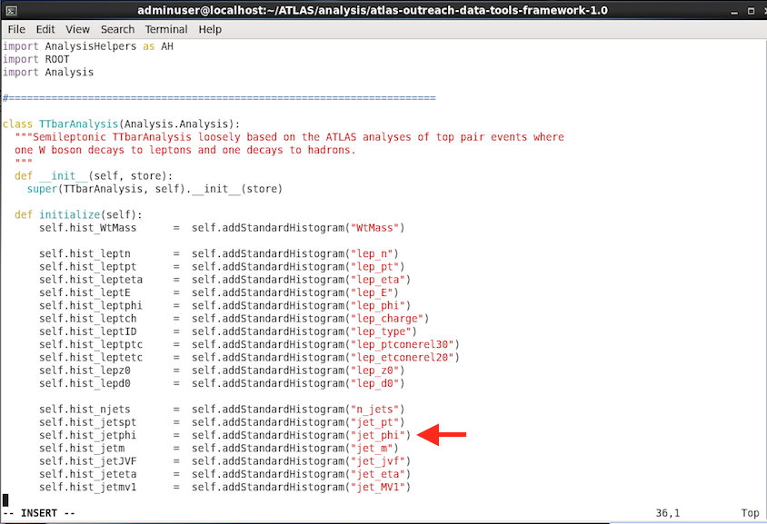
 
 Then add a line to fill your new histogram.  
 
 
 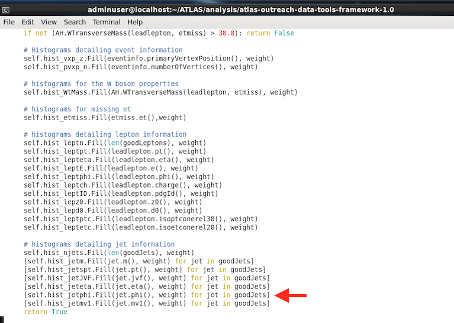
 
 
To save your changes, write and quit the Vim editor, by typing the escape key then 


```
:wq 
```

### 2. Analysis/StandardHistograms.py

Add a line to define your new histogram jet\_phi.

TH1D is a one-dimensional histogram in ROOT.

Define your histogram name as "jet_phi" with number of bins = 30, x-axis minimum = -3, x-axis maximum = 3.

So there will be 30 bins in the x-axis ranging from -3 to +3.  This range is reasonable if you remember from plotting the variable, at the start of this chapter, using root.

Your histogram title "Jet phi; #phi^{jet}; Jets" 
sets the main title as "Jet phi", 
the x-axis label as \(\phi^{jet}\)
and the y-axis label as "Jets".


```
vim Analysis/StandardHistograms.py
```

Don't forget to type i to enter insert mode.

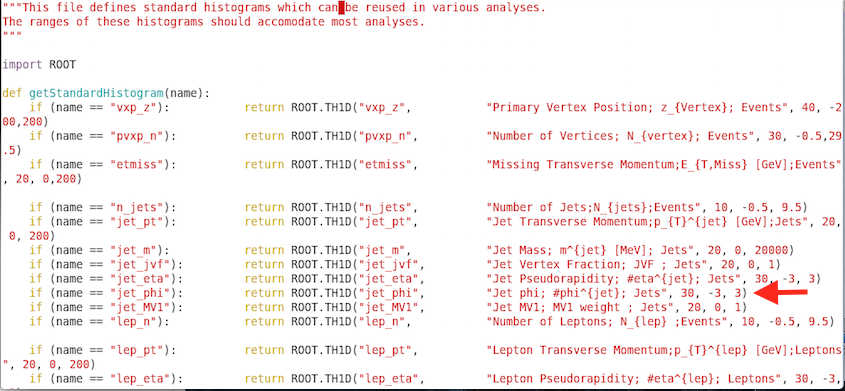


write and quit

by typing the escape key then 

```
:wq 
```


### 3. Configurations/PlotConf_TTbarAnalysis.py


```
vim Configurations/PlotConf_TTbarAnalysis.py
```

Add your histogram jet_phi to the list of histograms.
```
"jet_phi" : {};
```


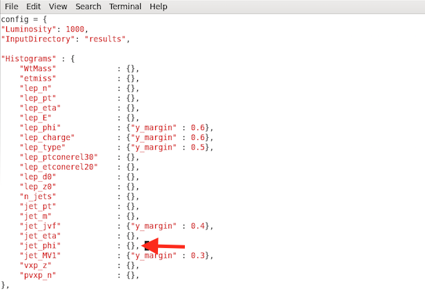

Write your changes and quit the file 

by typing the escape key then 
```
:wq 
```


  
      
 # If you are using the small VM
 ### 1. Analysis/TTbarAnalysis.py
 
 If you are using the small VM, select File/Open File...
 
 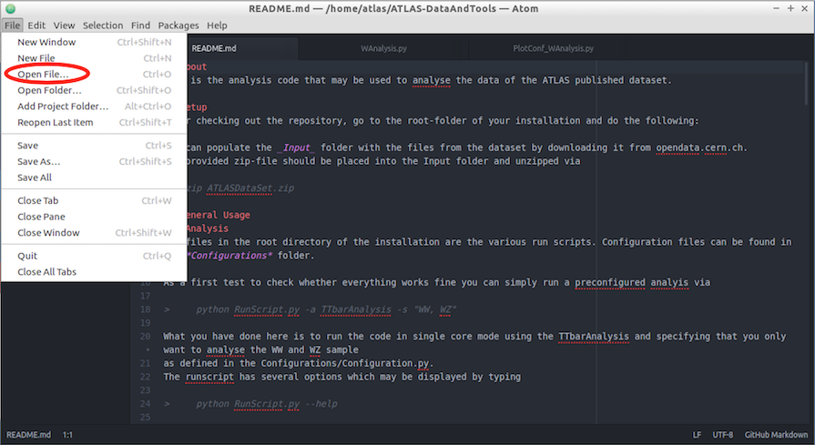
 
 Select the Analysis folder and Open
 
 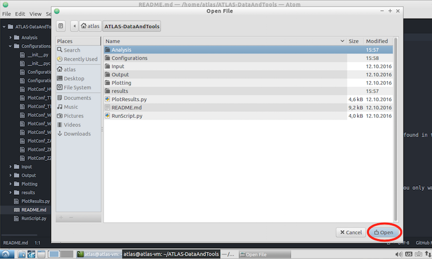
 
 Select TTbarAnalysis.py and Open
 
 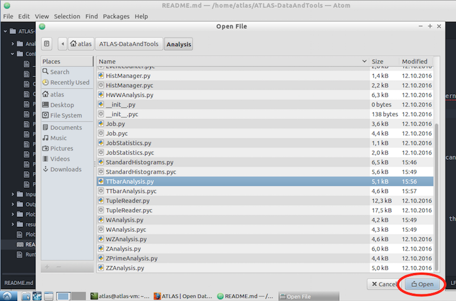
  

Add a line initialising the histogram jet\_phi, copying what was done for jet\_eta.

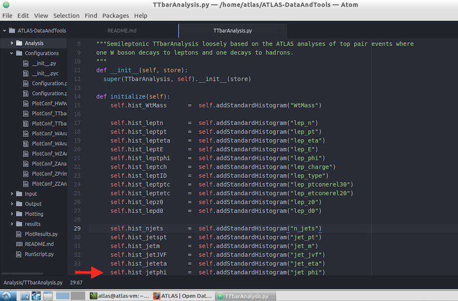

Then add a line to fill your new histogram

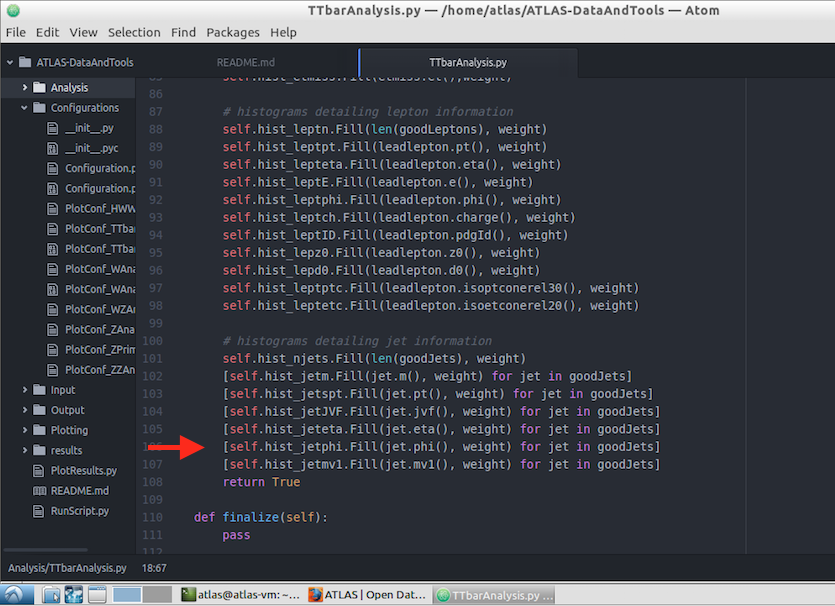

Save your changes

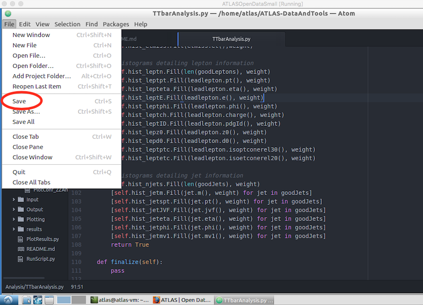

### 2. Analysis/StandardHistograms.py

Open StandardHistograms.py in the Analysis folder.
Add a line to define your new histogram jet\_phi.

TH1D is a one-dimensional histogram in ROOT.

Define your histogram name as "jet_phi" with number of bins = 30, x-axis minimum = -3, x-axis maximum = 3.

So there will be 30 bins in the x-axis ranging from -3 to +3.  This range is reasonable if you remember from plotting the variable, at the start of this chapter, using root.

Your histogram title "Jet phi; #phi^{jet}; Jets" 
sets the main title as "Jet phi", 
the x-axis label as \(\phi^{jet}\)
and the y-axis label as "Jets".

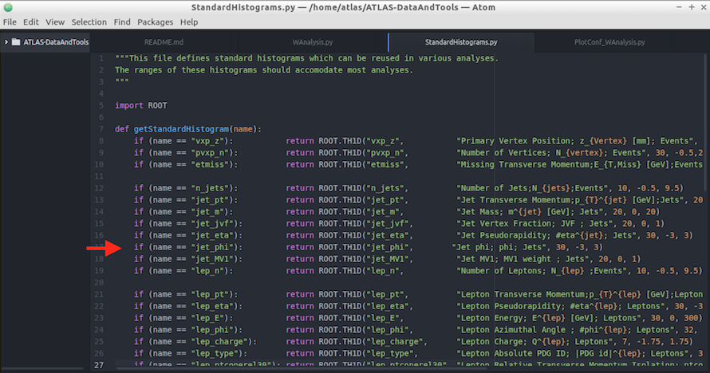

Save your changes

### 3. Configurations/PlotConf_TTbarAnalysis.py

Add jet_phi to the list of Histograms to be plotted
```
"jet_phi" : {};
```

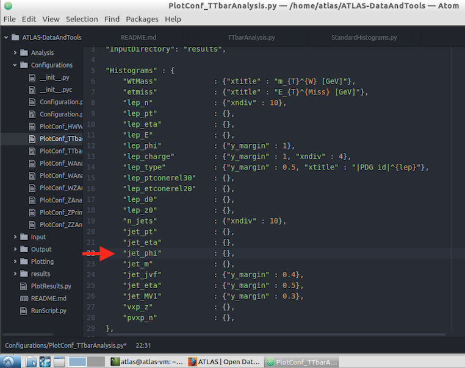

Save your changes


## Run the analysis and plot the results.

Can you remember what you need to do here?

You need to do this in 2 steps.
You need to run over all datasets (maybe a fraction of them) since you are creating new histograms and a new plot.

Step 1: Run the TTbarAnalysis

```
python RunScript.py -a TTbarAnalysis 
```

Step 2: Plot the results

```
python PlotResults.py Configurations/PlotConf_TTbarAnalysis.py
```


You will that your new plot has been created in the Output folder.

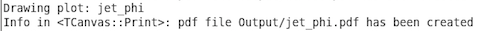

Then take a look


```
evince Output/jet_phi.pdf
```


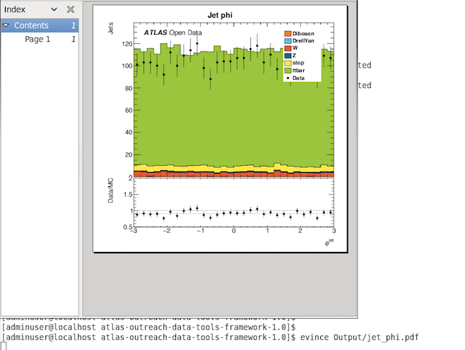


## Another way to create a new histogram.

Take a look in [Analysis/ZZAnalysis.py](https://github.com/atlas-outreach-data-tools/atlas-outreach-data-tools-framework/blob/master/Analysis/ZZAnalysis.py) 
and see if you can spot another method of creating a new histogram.

See if you can create jet_phi in the same way as invMass1 and invMass2 is done.

Have a go yourself before you look at the code below.

Run the analysis over all the data samples and plot your new histogram.

```
python RunScript.py -a ZZbarAnalysis
python PlotResults.py Configurations/PlotConf_ZZAnalysis.py

```

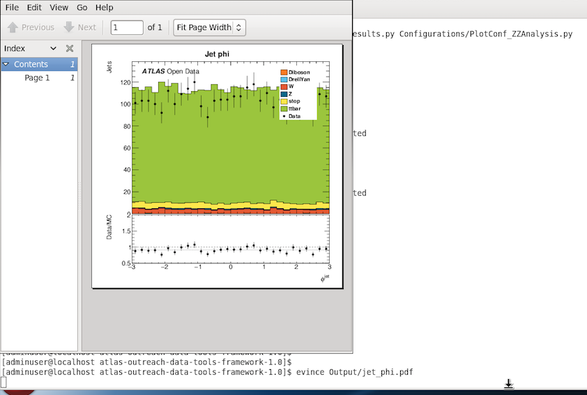


Here is the code to plot jet_phi in the ZZAnalysis.py

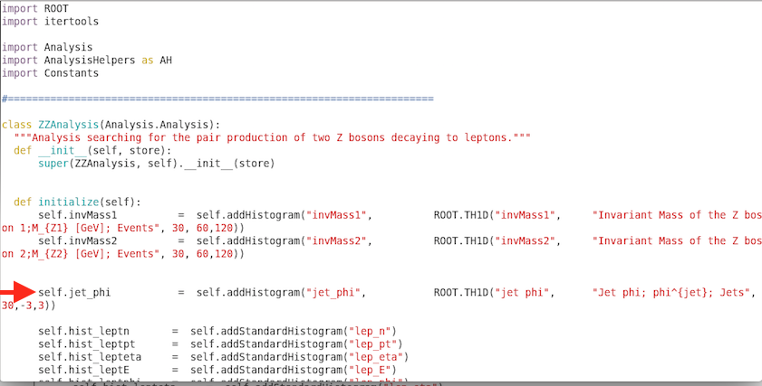

You also need to modify the configurations file Configurations/PlotConf_ZZAnalysis.py 
adding jet_phi to the list of histograms to be plotted.

```
"jet_phi" : {}
```


    

