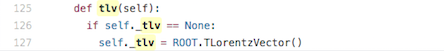

# Variable names

Here are the definitions of the variable names as used in the analysis code and in the ntuples.

| variable name | ntuple branchname | type | description |
| --- | --- | --- | --- |
| runNumber | runNumber | int | run identifier |
| eventNumber | eventNumber | int | event identifier |
|  | channelNumber | int | Data sample ID eg WW sample 105985 |
| mcWeight | mcWeight | float | weight of a simulated event |
| pvxp\_n | pvxp\_n | int | number of primary vertices |
| vxp\_z | vxp\_z | float | z-position of the primary vertex |
| SF\_PILEUP | scaleFactor\_PILEUP | float | scalefactor for pileup reweighting. It effectively reweights the profile of average interactions per bunch crossing so that simulated data is the same as measured data. |
| SF\_Ele | scaleFactor\_ELE | float | scalefactor for electron efficiency |
| SF\_Mu | scaleFactor\_MUON | float | scalefactor for muon efficiency |
| SF\_BTag | scaleFactor\_BTAG | float | scalefactor for btagging algorithm. Should only be applied if analysis is specifically using b-tagging. |
| SF\_Trigger | scaleFactor\_TRIGGER | float | scalefactor to account for the different operating efficiencies of the used triggers. |
| SF\_JVF | scaleFactor\_JVFSF | float | scalefactor for jet vertex fraction. |
| SF\_ZVertex | scaleFactor\_ZVERTEX | float | scalefactor to reweight the distribution of the z position of the primary vertex. |
| trigE | trigE | bool | boolean whether a standard trigger has fired in the egamma stream |
| trigM | trigM | bool | boolean whether a standard trigger has fired in the muon stream |
| passGRL | passGRL | bool | signifies whether event passes the Good Run List may be put in isGoodEvent |
| hasGoodVertex | hasGoodVertex | bool | signifies whether the event has at least one good vertex where Ntracks &gt; 4 |
| Lep\_n | lep\_n | int | number of preselected leptons |
|  | lep\_truthMatched | vector&lt;.bool&gt; | boolean indicating whether the lepton is matched to a simulated lepton |
| Lep\_trigMatch | lep\_trigMatched | vector&lt;.bool&gt; | boolean signifying whether the lepton is the one triggering the event |
| Lep\_pt | lep\_pt | vector&lt;.float&gt; | transverse momentum of the lepton |
| Lep\_eta | lep\_eta | vector&lt;.float&gt; | pseudorapidity of the lepton |
| Lep\_phi | lep\_phi | vector&lt;.float&gt; | azimuthal angle of the lepton |
| Lep\_e | lep\_E | vector&lt;.float&gt; | energy of the lepton |
| Lep\_z0 | lep\_z0 | vector&lt;.float&gt; | z-coordinate of the track associated to the lepton wrt. the primary vertex |
| Lep\_charge | lep\_charge | vector&lt;.float&gt; | charge of the lepton |
| Lep\_pdgid | lep\_type | vector&lt;.int&gt; | number signifying the lepton type \(e, mu, tau\) of the lepton |
| Lep\_flag | lep\_flag | vector&lt;.int&gt; | bitmask implementing object cuts |
| Lep\_ptcone30 | lep\_ptcone30 | vector&lt;.float&gt; | scalar sum of track pTs in a cone of R=0.3 around lepton, not including lepton \(p_T\) itself |
| Lep\_etcone20 | lep\_etcone20 | vector&lt;.float&gt; | scalar sum of track ETs in a cone of R=0.2 around lepton, not including lepton ET itself |
| Lep\_d0 | lep\_trackd0pvunbiased | vector&lt;.float&gt; | d0 of the track associated to the lepton at the point of closest approach \(p.o.a.\) |
| Lep\_d0sig | lep\_tracksigd0pvunbiased | vector&lt;.float&gt; | d0 signifcance of the track associated to the lepton at the p.o.a. |
| Met\_et | met\_et | float | Transverse energy of the missing momentum vector |
| Met\_phi | met\_phi | float | Azimuthal angle of the missing momentum vector |
| Jet\_n | jet\_n | int | number of selected jets |
|  | alljet\_n | int | total number of jets in event |
| Jet\_pt | jet\_pt | vector&lt;.float&gt; | transverse momentum of the jet |
| Jet\_eta | jet\_eta | vector&lt;.float&gt; | pseudorapidity of the jet |
| Jet\_phi | jet\_phi | vector&lt;.float&gt; | azimuthal angle of the jet |
| Jet\_e | jet\_E | vector&lt;.float&gt; | energy of the jet |
| Jet\_mass | jet\_m | vector&lt;.float&gt; | invariant mass of the jet |
| Jet\_jvf | jet\_jvf | vector&lt;.float&gt; | jet vertex fraction of the jet |
| Jet\_flag | jet\_flag | vector&lt;.int&gt; | bitmask implementing object cuts of the top group |
| truepdgid | jet\_trueflav | vector&lt;.int&gt; | flavor of the simulated jet |
| isTrueJet | jet\_truthMatched | vector&lt;.int&gt; | information whether the jet matches a simulated jet |
|  | jet\_SV0 | vector&lt;.float&gt; | Weight from algorithm that reconstructs Secondary Vertices associated with a jet |
| Jet\_mv1 | jet\_MV1 | vector&lt;.float&gt; | Weight from algorithm based on Multi-Variate technique |

The scalefactors correct for known differences between data and simulated data.

## Reading the datasets.

The data is stored in ROOT tuples, which can be looked at directly using ROOT TBrowser.

In the provided analysis code the tuples are read by [TupleReader.py](https://github.com/atlas-outreach-data-tools/atlas-outreach-data-tools-framework/blob/master/Analysis/TupleReader.py)

Some of the variable names have been 'redefined' in TupleReader.py  
For example

```
self.Lep_d0 = self.activate("f", "lep_trackd0pvunbiased", max_Lep)
```

So the snappily named tuple variable lep\_trackd0pvunbiased can be accessed as just Lep\_d0 in the analysis code.

## The Lorentz vector.

Four-momentum is a [four-vector](https://en.wikipedia.org/wiki/Four-vector) in [spacetime](https://en.wikipedia.org/wiki/Spacetime).  It is useful in relativistic calculations because it is a Lorentz vector. This means that it is easy to keep track of how it transforms under [Lorentz transformations](https://en.wikipedia.org/wiki/Lorentz_transformation).

[TLorentzVector](http://root.cern.ch/root/html/TLorentzVector.html) is a general four-vector class in [ROOT](https://root.cern.ch/), which can be used either for the description of position and time \(x,y,z,t\) or momentum and energy \(px,py,pz,E\).

In [TupleReader.py](https://github.com/atlas-outreach-data-tools/atlas-outreach-data-tools-framework/blob/master/Analysis/TupleReader.py) it is defined



In various analyses it is used e.g.[ HWWAnalysis.py](https://github.com/atlas-outreach-data-tools/atlas-outreach-data-tools-framework/blob/7a2729410fcb8d5842eae1bd454096c537a3fa6e/Analysis/HWWAnalysis.py)


# Navigation
Go to the next [section]( "Glossary") or jump back to the [summary page]( "Summary page").