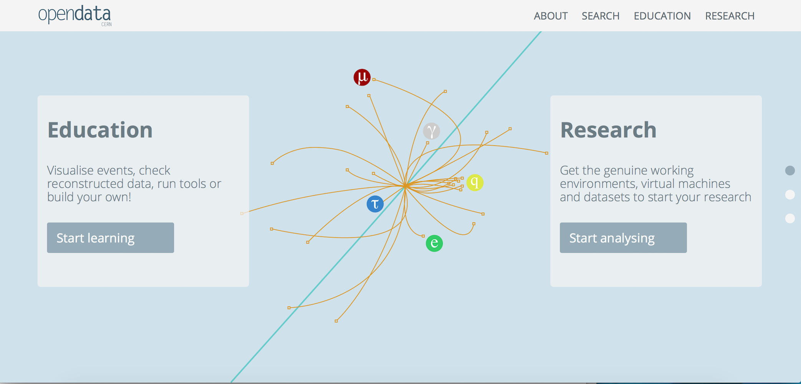

Welcome to ATLAS at the LHC.  
We have prepared some data for you.  Come and take a look.  
It is ready for you to use, just for curiosity, as a teaching tool or to dive in and write your own analysis code.  

This section is aimed at University students and post graduate researchers.  Software skills may help, but are not essential.  A good amount of motivation is the main requirement to follow the various steps.

If you are a high school student, or just interested in data and software, feel free to take a look.  You may just find some of the physics terms not very clearly explained.

Use the arrows below to navigate through this booklet.
Or click on the hamburger icon (4 horizontal lines) above to access the chapters directly.

[TEST] ( )