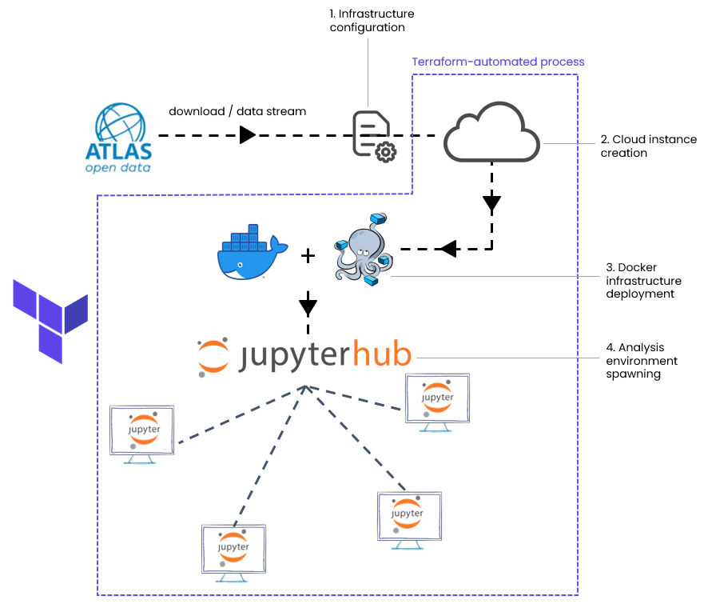
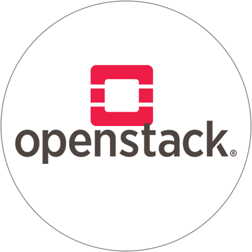

Benvenuto nella pagina dedicata al "Automated Infrastructure Deployment Tool"!
Ti sei mai chiesto come poter ottenere un ambiente di analisi funzionante e multi-utente da poter utilizzare con i tuoi studenti?</br>
Questa pagina ti guiderà passo dopo passo nella configurazione di una infrastruttura [JupyterHub](https://jupyter.org/hub) (JH) ospitata su una istanza cloud. Verrà inoltre presentato il notebook utilizzabile sia autonomamente, che in combinazione con JH.

Ti presentiamo uno strumento avanzato che permette a **chiunque** di istanzare il proprio JH. </br>
Perchè a chiunque? Perchè non sono richiesti prerequisiti di alto livello, infatti è sufficiente avere una _conoscenza di base_ del termianle linux, e l'accesso ad un _cloud provider_ su cui generare l'infrastruttura.


## Caratteristiche

Ecco di seguito un breve sommario delle caratteristiche principali dello strumento </br>
(se non ti interessa la teoria, vai direttamente alla [dashboard](#deployment-dashboard) e comincia la configurazione!)

* **Intercambiabilità dei notebook**: JH non sarà vincolato dalla scelta di un notebook specifico. ALTAS Open Data fornisce un [notebook standard](#single-user-solutions), ma se vuoi utilizzare un'altra immagine Docker su un registry, puoi includere quella nell'infrastruttura senza alcuno sforzo. Questo permette sia di avere un alto livello di personalizzazione, che di sfruttare JH per applicazioni che non siano necessariamente le analisi di Open Data.
* **Persistenza dei dati**: il tuo lavoro non verrà eliminato al termine della sessione. Non ci saranno timeout del server che causeranno la perdita dei progressi nel notebook. I dati, i plot e i risultati sono salvati ed accessibili in qualsiasi momento.
* **Volumi esterni/condivisi**: se si deve analizzare un dataset di grandi dimensioni, è fondamentale poter condividere le risorse, evitando così di obbligare gli utenti singoli a scaricare una grande mole di dati.
* **Velocità**: questo strumento è _veloce_. Il tempo necessario per configurare da zero l'infrastruttura si aggira intorno alla decina di minuti (e questa è una operazione che viene eseguita una volta soltanto). Una volta che JH è operativo, gli utenti possono aprire i propri notebook nel giro di _qualche secondo_.

## Workflow

I pilastri portanti dell'intero processo di istanziazione sono **due** servizi fondamentali: [Docker](https://www.docker.com/) e [Terraform](https://www.terraform.io/). </br>
Docker provvede alla **modularità** dell'infrastruttura, abilitando la maggior parte delle caratteristiche riportate sopra. Infatti, l'agilità e la flessibilità dell'intero sistema sono dovute alla containerizzazione dell'infrastruttura. D'altra parte, Terraform assicura l'**automatizzazione** del processo di deployment di JH. Un diagramma esplicativo del processo di istanziazione è riportato sotto.

<p align="center">
  
</p>

## Soluzioni single-user

### Jupyter Notebooks
I [Jupyter notebooks](https://jupyter.org/) sono alla base delle risorse di analisi messe a disposizione da ATLAS Open Data. </br>
Vi presentiamo un notebook basato sull'ultima versione dei notebook [scipy](https://hub.docker.com/r/jupyter/scipy-notebook), a cui integriamo l'installazione del framework [ROOT](https://root.cern/) utilizzato al CERN, disponibile sia nel kernel python che in quello C++. Altre versioni di questi notebook sono in fase di sviluppo. </br
Puoi utilizzare il notebook sia in modalità indipendente, che in combinazione con il JH descritto sopra. Prova ora il notebook sul tuo pc semplicemente eseguendo questo comando docker in un terminale:
```
docker run -it --rm -p8888:8888 atlasopendata/root_notebook:latest
```
A questo punto, accedi al notebbok attraverso il browser, seguendo le istruzioni che il comando ritorna come output:
```
To access the notebook, open this file in a browser:
        file:///home/jovyan/.local/share/jupyter/runtime/nbserver-15-open.html
    Or copy and paste one of these URLs:
        http://4c61742ed77c:8888/?token=34b7f124f6783e047e796fea8061c3fca708a062a902c2f9
     or http://127.0.0.1:8888/?token=34b7f124f6783e047e796fea8061c3fca708a062a902c2f9
```
Ricorda: il token cambia ogni volta!
### Macchine virtuali
ATLAS Open Data mette anche a disposizione delle [macchine virtuali](http://opendata.atlas.cern/release/2020/documentation/vm/index.html), che permettono l'analisi dei dataset a 13 TeV direttamente sul tuo pc.

Guarda le nostre risorse più da vicino:

| <h1><b>Jupyter Notebooks</b></h1> | <h1><b>Macchina virtuale</b></h1> |
|        :---:        |        :---:       |
| [](https://hub.docker.com/r/atlasopendata/root_notebook) | [](http://opendata.atlas.cern/release/2020/documentation/vm/index.html) |

&nbsp;

## Deployment dashboard

Seleziona il provider cloud che preferisci (meglio se è uno di cui possiedi le credenziali di accesso :D) e segui le istruzioni!

| <h1><b>AWS instance</b></h1> | <h1><b>OpenStack@CERN instance</b></h1> | <h1><b>Google Cloud instance</b></h1> |
|        :---:        |        :---:       |        :---:       |
| [](https://gitlab.cern.ch/atlas-open-data-iac-qt-2021/aws_automated_jh_deployment/-/blob/master/README.md) | [](https://gitlab.cern.ch/atlas-open-data-iac-qt-2021/automated_jh_deployment/-/blob/master/README.md) | []()|


